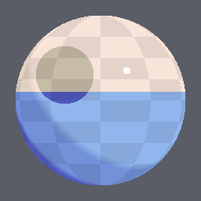
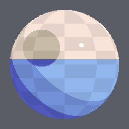
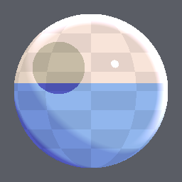
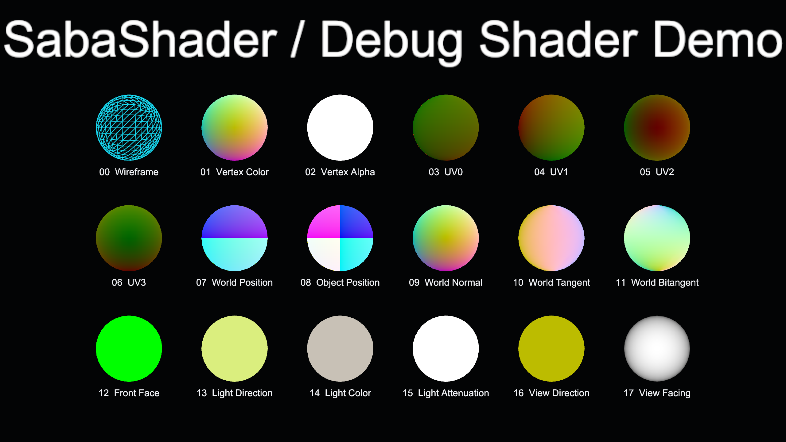
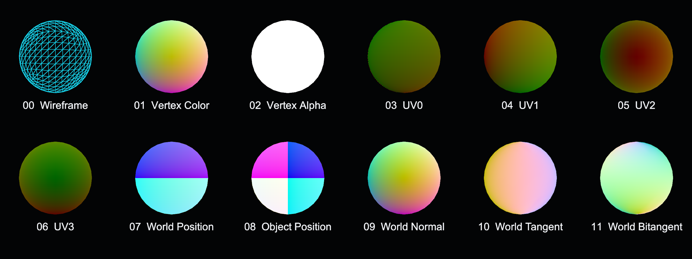
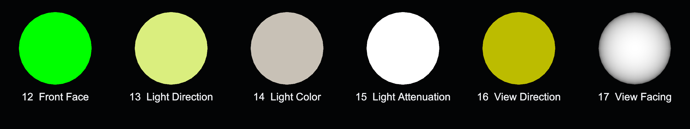

# Core Shader一覧

Core ShaderはMaterialの`Shader`欄で直接選択する描画本体です。SabaShaderには、完成表示用の`SabaShader/Illust2D`と、mesh入力を調べる`SabaShader/Debug`があります。

## Core ShaderとShader拡張の違い

| 種類 | 選択場所 | 役割 | このページの対象 |
| --- | --- | --- | --- |
| Core Shader | Material Inspector上部の`Shader` | ライティング、色、透過、描画passを含む描画本体 | Illust2D、Debug |
| Shader拡張 | 対応Materialの`Select Modules` | 描画本体の特定phaseへ機能を追加 | [Shader拡張一覧](shader-extensions.md) |

Core ShaderはMaterialごとに1つだけ選びます。Shader拡張は対応するCore Shaderへ複数追加できます。`SabaShader/Debug`は診断値を変えないために拡張phaseを公開しません。

## Illust2D

3Dモデルを2Dイラスト調に見せる、Built-in Render Pipeline向けtoon shaderです。2段の影色、硬さを調整できる境界、ハイライト、リムライト、色トレス輪郭線を1つのMaterialで設定できます。

### 使い方

1. 対象Materialを複製する
2. `Shader`から`SabaShader/Illust2D`を選ぶ
3. `Texture / Color`と`Normal Map / Roughness`を設定する
4. `Shade 1 / 2`で影色と境界を決める
5. 必要に応じてハイライト、リムライト、輪郭線、Shader拡張を有効にする

### 主要パラメータ

| 目的 | 主なパラメータ | 調整結果 |
| --- | --- | --- |
| ベース表示 | `Texture / Color`、`Normal Map / Roughness`、`Cull`、`Alpha Mode / Cutoff` | 色、表面法線、粗さ、両面描画、Cutoutを設定 |
| 影の形 | `Shade 1 / 2 Border`、`Shade 1 / 2 Blur`、`Ramp Steps` | 影の位置、硬さ、段数を設定 |
| 影の色 | `Hue Shift`、`Saturation / Value`、`Multiply Color` | ベース色から独立した1影・2影の色を生成 |
| ハイライト | `Specular Sharpness`、`Border / Blur` | 硬いtoon highlightの大きさと縁を設定 |
| リムライト | `Rim Color`、`Border / Blur`、`Follow Light Direction` | 輪郭付近の発光色と出る方向を設定 |
| 輪郭線 | `Outline Width`、`Base Color Blend`、`Distance Compensation` | 太さ、色トレス、距離補正を設定 |
| ワールド適応 | `Brightness Min / Max`、`Monochrome Lighting`、`As Unlit` | ワールドごとの照度差やライト色の影響を制限 |

全項目と数式上の挙動は[Illust2Dの詳細](shader-illust2d.md)を参照してください。

## Debug

mesh、UV、頂点カラー、法線、tangent、面方向、ライト入力を色で可視化する診断用shaderです。完成表示には使わず、問題箇所を特定したら元のMaterialへ戻します。

### 使い方

1. 調査対象Materialを複製する
2. `Shader`から`SabaShader/Debug`を選ぶ
3. `Display Mode`で調べる入力を選ぶ
4. 裏面確認では`Culling = Off`、UVやpositionの周期調整では`Coordinate Scale`を変更する
5. DCCツールまたは元Materialを修正し、診断用Materialを外す

### 主要パラメータ

| パラメータ | 対象 | 調整結果 |
| --- | --- | --- |
| `Display Mode` | 全18モード | Wireframe、Vertex Color、UV0からUV3、position、normal、light、viewを切り替え |
| `Culling` | 全モード | 表面、裏面、両面の表示を切り替え |
| `Coordinate Scale` | UV、position | 周期色の繰り返し倍率を調整 |
| `Wire Color / Background Color` | Wireframe | triangle edgeと内部の色を設定 |
| `Wire Width` | Wireframe | screen-space基準の線幅を設定 |

各表示色の読み方と制約は[Debug shaderの詳細](shader-debug.md)を参照してください。Wireframeはgeometry shaderを使うためPC専用です。

## 選択基準

| やりたいこと | 選択 |
| --- | --- |
| avatarやworldをイラスト調に描画する | Illust2D |
| UV seamや頂点カラーを確認する | Debug |
| normal、tangent、裏面、triangle分割を確認する | Debug |
| 雨、pixel化、映像、空間、遷移などを既存表示へ追加する | [Shader拡張](shader-extensions.md) |
