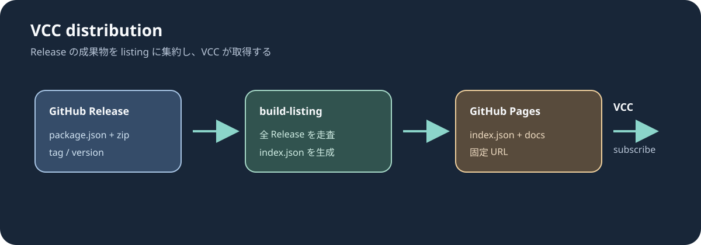

# 配布のしくみとリリース手順

VCC は「リスティング（`index.json`）を 1 本購読し、その中に書かれた zip を取りに行く」
という仕組みで動きます。このリポジトリはその一式を GitHub だけで完結させています。



```
git tag 0.1.0                              main への merge
        │                                          │
        ▼                                          │
build-release.yml                                  │
  Packages/io.github.sabas0ba.sabashader を zip 化  │
  GitHub Release に zip と package.json を添付      │
        │                                          │
        ▼ (release published)                      ▼ (push)
                   build-listing.yml
        全リリースを走査して index.json を生成
        docs を HTML にして GitHub Pages に配信
                          │
                          ▼
VCC が https://sabas0ba.github.io/vrc_sabashader/index.json を読む
```

## サイトが更新されるとき

`build-listing.yml` は次の 3 つで走ります。同時に走らないよう
`concurrency: pages` で直列化してあります。

| きっかけ | 主に反映されるもの |
| --- | --- |
| `main` への push（PR の merge） | docs の内容とサイトの見た目 |
| リリースの公開 | `index.json` のバージョン一覧 |
| `workflow_dispatch`（手動実行） | 上記の両方（配信し直したいとき） |

どのきっかけでも作る中身は同じです。`index.json` は毎回 Releases API から
組み直すので、merge で走らせても配信済みのバージョンは変わりません。

サイトの中身は**常に `main` から**作ります（`checkout` の `ref` を固定）。
`release` イベントの既定はタグのコミットなので、そのままだと古いタグの
リリースを公開したときに docs が巻き戻ります。

## 初回だけ必要な設定

1. リポジトリの `Settings` > `Pages` で **Source** を `GitHub Actions` にする
2. `listing.json` の `repository` / `url` / `author` が自分のものになっているか確認する

## リリース手順

1. `Packages/io.github.sabas0ba.sabashader/package.json` の `version` を上げる
2. `Packages/io.github.sabas0ba.sabashader/CHANGELOG.md` に項目を足す
3. ファイルを追加していたら `python tools/gen_meta.py` を実行して `.meta` をコミットする
4. `python -m pytest tests -q` が緑になっていることを確認する
5. `version` と同じ名前でタグを打って push する

```bash
git tag 0.1.0
git push origin 0.1.0
```

タグ名と `package.json` の `version` が食い違っていると
`build-release.yml` が明示的に失敗します。

`workflow_dispatch` から手で流すこともできます（その場合はタグが自動で作られます）。

## リスティングの中身

`tools/build_listing.py` が GitHub Releases API を走査して組み立てます。

- 各リリースの `package.json` アセットを読み、`listing.json` の `packages` に
  載っているパッケージだけを採用する
- zip アセットの URL を `url` に、その SHA-256 を `zipSHA256` に入れる
- ドラフトのリリースは無視する
- バージョンは新しい順に並べる（プレリリースは同じ数値より前）

ネットワーク無しで動作確認する場合:

```bash
python tools/build_listing.py --releases path/to/releases.json --output /tmp/index.json --html /tmp/index.html
```

## `.meta` と GUID について

マテリアルはシェーダーを **GUID** で参照します。
利用者ごとに GUID が変わると、更新のたびにマテリアルがシェーダーを見失います。
そのため `.meta` は必ずリポジトリにコミットして配布します。

`tools/gen_meta.py` はパッケージ内の相対パスから `uuid5` で GUID を導出するので、
誰がいつ実行しても同じ値になります。既存の `.meta` は書き換えません。

```bash
python tools/gen_meta.py          # 足りないものを作る
python tools/gen_meta.py --check  # 足りないものがあれば終了コード 1
```

> ファイルを **リネーム** するときは `.meta` も一緒に `git mv` してください。
> GUID が保たれるので参照が切れません。逆に `.meta` を消して作り直すと
> GUID が変わってしまうので、一度リリースしたファイルの `.meta` は消さないでください。
> GUID の重複は `tests/test_packaging.py` が検査します。

## 利用者側の手順

VCC には Shader Core のリスティングも追加してもらう必要があります。
VPM は依存パッケージを別リスティングから自動で引いてこないためです。

```
https://sabas0ba.github.io/vrc_sabashader/index.json
https://lilxyzw.github.io/vpm-repos/vpm.json
```

Pages に配信される案内ページ（`index.html`）には
`vcc://vpm/addRepo?url=...` のワンクリック追加リンクを置いてあります。

## サイトの見た目

案内ページと docs のページは同じガワで出しています。ヘッダー・ナビ・
フッター・配色は `tools/site_theme.py` に集約してあるので、
見た目を変えるときはこの 1 ファイルだけを触ってください。
片方だけに CSS を足すと 2 つのページがズレます。

ダークモードは 2 段構えです。

- 既定は OS の設定に追従する（`prefers-color-scheme`）
- 右上の「テーマ」ボタンで明示的に切り替えると `localStorage` に覚える

色は素の `:root` に定義し、`@media (prefers-color-scheme: dark)` と
`:root[data-theme="dark"]` では**上書きだけ**をします。
片方でしか定義していない変数を作ると、もう一方のテーマで色が抜け落ちます。
明暗で定義が食い違っていないことは `tests/test_docs_site.py` が検査します。
描画例はテーマで色を変えず、枠と余白だけを合わせます。

## docs の体裁

ページごとに構えが違うと、サイトに出したときに読み口が揃いません。
書き方は次のとおりで、`tests/test_docs_site.py` が全ページを検査します。

- 1 ファイル 1 見出し（`#`）。ファイルの 1 行目に置く
- 見出しの直後に 1 段落の要約を置く。案内ページの索引にはこの 1 文目が出る
- 見出しの階層は飛ばさない（`#` の次は `##`）
- 描画回帰テストの図は ``、
  Unity のキャプチャや手順図は `` の形で行頭または表のセルに単独で置く。
  空行を挟まずに続けて書くと横に並ぶので、比較したい図はそう書く

要約の下には `##` の目次が自動で入ります。手で書く必要はありません。

全ページの**並びと表記**は `tools/render_docs.py` の `PAGES` が決めます。
左ペインはシェーダー・モジュール・ガイドに分類し、`PAGES` の全ページを表示します。
旧 URL の互換ページだけは左ペインから除外します。トップページの索引は
同ファイルの `PRIMARY_PAGES` で絞り、シェーダー一覧とモジュール一覧を入口にします。
docs を足したら `PAGES` にも追加し、入口にするページだけ `PRIMARY_PAGES` に載せます。
過不足があるとサイトの生成がその場で落ちます。

## 図の出どころ

シェーダーやモジュールの見た目は実際の描画結果で示します。ヘッドレスの
[描画回帰テスト](testing.md)は `tests/golden/*.png` を参照し、Unity のサンプル
シーンで撮影した画像は `docs/assets/*.png` に置きます。構成や操作の図は
`docs/assets/*.svg` を使用できます。

- ゴールデン画像は出荷する数式を描いたもので、数式の変更時に回帰テストで差分を確認する
- Unity キャプチャは使用したサンプル、Unity の版、設定値を本文に明記する
- 概念図は処理の流れや操作だけに使用し、描画結果として扱わない
- サイトへ出すときだけ `_site/docs/figures/` へ複写される

実装結果の図を足したいときは `tests/cases.py` にケースを足し、CI と同じコンテナで
ゴールデンを生成してから docs から参照します（[テストの仕組み](testing.md#ケースを足すときの基準)）。
構成や操作を示す図を足すときは `docs/assets/` に SVG を追加し、alt text で内容を説明します。
Thin2D の Unity キャプチャは、固定した Shader Core の依存を用意した後、
Unity 2022.3.22f1 で `SabaShader.CI.Thin2DDemoBuilder.BuildBatch` を実行して再生成します。
出力は `_test_artifacts/Thin2D-demo.png` と `_test_artifacts/Thin2D-demo-side.png` です。
両画像を目視し、シェーダーのコンパイルエラーがないことを確認してから `docs/assets/` に配置します。
