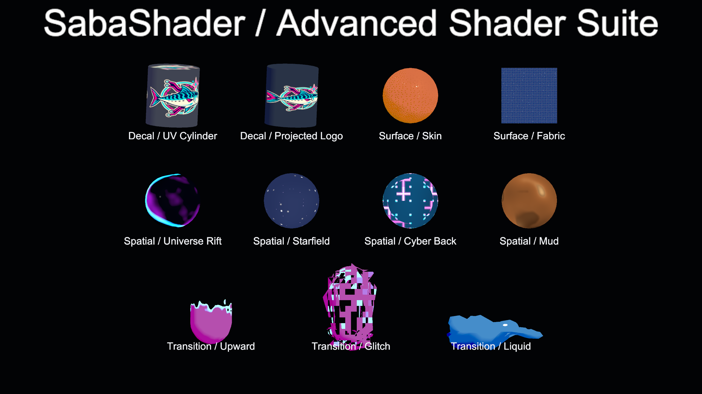
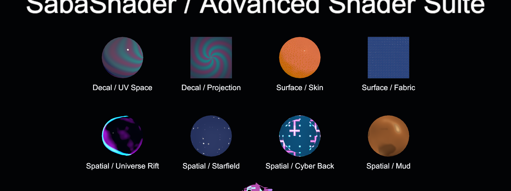
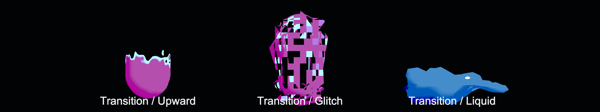

# 高度シェーダーモジュール

Decal、Surface Detail、Spatial Interior、Transition、Mochi Skinの用途、設定手順、制約をまとめます。
5機能は `SabaShader/Illust2D` へ個別に追加でき、不要な機能は `Amount = 0` または
`Progress = 1` の安全な既定値で無効になります。

> このページの図は Package 同梱の `Advanced Shader Suite Demo` を Unity
> 2022.3.22f1 で描画したゴールデン画像です。手で作成した説明図ではありません。

## 有効化とサンプル

Shader Core の Project Settings で `SabaShader/Illust2D` に次のモジュールを追加します。

- Decal
- Surface Detail
- Spatial Interior
- Transition
- Mochi Skin

Package Manager の `Samples` から `Advanced Shader Suite Demo` を Import し、
`AdvancedShaderSuiteDemo.unity` を開くとMochi Skinを除く4機能の代表設定を確認できます。



`Advanced Shader Demo Object` はサンプル専用の表示補助Componentで、通常の
`Add Component` メニューからは除外しています。アバターやワールドには追加しません。
モジュール構成を変更した後にサンプルがマゼンタになる場合は、各オブジェクトで
`Rebuild Demo Preview` を実行するか、コンポーネントを有効化し直します。
Transitionの3オブジェクトはPlay Modeで自動再生します。手動で確認する場合は
`Auto Animate in Play Mode` を無効にしてから `Progress` を操作します。

## Decal

任意画像をアルベドへ合成します。用途は肌のタトゥー、衣服のロゴ、汚れ、識別記号などです。
UV Space と object-space Projection を切り替えられます。
サンプルでは方向の分かる同一エンブレムを2本のシリンダー側面へ貼り、UV展開に沿う場合と
object-spaceの直方体から投影する場合を比較できます。
このエンブレムは画像生成によるサンプル専用の架空図案で、SabaShaderの正式ロゴではありません。



### マッピング

| Mapping | 座標 | 用途 | 制約 |
| --- | --- | --- | --- |
| UV Space | 選択した UV0–UV3 | UV上の正確な配置、既存テクスチャと同じ追従 | UV展開と継ぎ目の影響を受ける |
| Projection | object space の直方体 | UV編集なしの局所配置、同じ設定の再利用 | 投影方向に平行な面では消え、曲面の裏側へは回り込まない |

Projection では `Projector Center` が直方体の中心、`Projector Rotation` が度単位の
XYZ Euler角、`Projector Size` の XY が画像の幅と高さ、Z が投影の深さです。
投影方向はローカル +Z で、画像を受ける面は投影方向と逆向きの法線を持つ必要があります。
`Angle Fade` で斜めの面を除外し、`Edge Softness` で直方体の境界をぼかします。

### 合成とマスク

| プロパティ | 説明 |
| --- | --- |
| Amount | Decal全体の適用率。`0` でテクスチャを参照しない |
| Texture / Tiling / Offset | 合成するRGBA画像と使用領域 |
| Tint | RGBは画像へ乗算し、アルファは合成率へ乗算する |
| Blend Mode | Alpha、Multiply、Add |
| UV Channel | UV Spaceで使用するUVセット |
| Mask Channel | Illust2DのShared Maskで適用部位を限定する。Noneで全面 |

複数の独立したDecalを1マテリアルへ重ねる機能は持ちません。複数枚が必要な場合は
テクスチャを事前に合成するか、同じモジュールの複製に別の `uniqueID` を割り当てます。

## Surface Detail

AOを追加するのではなく、UV上に微細な高さ場を作り、色の微差、micro normal、
roughnessのばらつき、微小反射へ分けて適用します。Skinは不規則な毛穴、Fabricは
縦糸と横糸を模した織りを手続き生成します。

| プロパティ | 説明 |
| --- | --- |
| Amount | 全体の適用率 |
| Mode | Skin または Fabric |
| Scale | UV内の模様密度。モデルの実寸ではなくUV基準 |
| Albedo Variation | 微細な明暗差。強すぎると汚れに見える |
| Normal Strength | micro normalの強さ |
| Roughness Variation | 粗さと反射の細かな分断量 |
| Pore | Skinの毛穴の深さ |
| Weave | Fabricの織りの高さ |
| Sheen / Sheen Color | Skinの小さい反射、Fabricのgrazing sheen |
| Mask Channel | Shared Maskで肌や衣服などの部位を限定する |

`Detail Texture` を指定すると、RGBの輝度を色とroughnessのばらつきへ、RGを
追加のdetail normalへ使用します。専用テクスチャを使う場合はRGの中立値を
`0.5` にしてください。手続き模様とテクスチャは加算されます。

この機能は視差遮蔽や頂点変位を行わないため、シルエットは変化しません。
UVの密度が部位ごとに違うモデルでは `Scale` の見え方も変わります。皮膚の
subsurface scatteringや布の異方性BRDFは実装していません。

## Mochi Skin

VRChatのContact Receiverが出力する4つのFloatを、UV上の固定した4接触点の押し込み量へ
変換します。中央を頂点法線の内側へ変位させ、周囲へ小さい盛り上がりを作り、同じ高さ場の
UV勾配をtangent-space法線へ加えます。Shader Coreの`morph`と`base`を使用するため、
`SabaShader/Illust2D`のほか、これらのphaseを持つ
[NonToon](https://github.com/lilxyzw/NonToon)などのShader Core shaderへ追加できます。

### Material設定

Shader CoreのProject Settingsで対象shaderへ`Mochi Skin`を追加します。まず`Amount = 1`、
各`Pressure = 1`として位置を確認し、設定後にPressureを0へ戻します。

| プロパティ | 説明 |
| --- | --- |
| Amount | モジュール全体の適用率。既定値の0で変形しない |
| UV Channel | 4点の配置に使うUV0–UV3 |
| Depth | Pressureが1のときに頂点を内側へ動かす最大距離。world単位 |
| Outer Bulge | 凹みの外周に作る盛り上がり。Depthに対する比率 |
| Normal Strength | 高さ場から作る法線の強さ。頂点変位量は変えない |
| Contact Point 0–3 | XYがUV中心、ZWが楕円のUV半径 |
| Pressure 0–3 | Animatorから駆動する0–1の押し込み量 |

Debug shaderのUV0–UV3表示またはDCCのUV editorで、各Receiverを置く肌位置に対応するUVを
確認します。UV islandが重なるmeshでは、同じUV範囲にある別部位も同時に変形します。

### Contact ReceiverとFX Animator

接触点ごとに、肌表面へ追従するGameObjectと`VRC Contact Receiver`を1個用意します。
例としてPoint 0は次のように対応付けます。

1. ReceiverをHead bone配下の頬位置へ置き、ShapeをSphere、Receiver Typeを`Proximity`にする。
2. Collision Tagsへ`Finger`と`Hand`を追加し、`Allow Others`を有効にする。自分の手にも反応させる場合だけ`Allow Self`を有効にする。
3. ParameterをFloatの`Mochi/P0`にする。他の3点は`Mochi/P1`から`Mochi/P3`を使用する。
4. FX Animatorへ同名のFloatを追加する。Contact用parameterはExpression Parametersへ追加しなくてもよい。
5. 0と1のAnimation Clipを持つ1D Blend Treeを作り、`Mochi/P0`をBlend Parameterにする。Clipでは対象Rendererの次のmaterial propertyだけを記録する。

```
material._io_github_sabas0ba_mochiskin_Pressure0
```

Point 1–3では末尾を`Pressure1`–`Pressure3`へ変え、独立したFX layerで同様に駆動します。
VRChatのProximityは接触位置そのものではなく、Receiver中心への近さを0–1で出力します。
このため1個のReceiver内で凹み中心が指に追従する方式ではなく、4個の固定領域から最も近い
領域を連続的に押す方式です。

他アバターからの接触を各clientで評価させる場合は`Local Only`を無効にします。
`Local Only`を有効にしたReceiverは装着者のlocal clientに限定されます。一方、無効なReceiverは
avatar performance rankのContacts数へ算入されます。動作はVRChat側のAvatar Interactions設定と
Safety設定によって無効化される場合があります。

VRChatはhumanoid avatarの標準Hand／Finger Contact Senderを自動生成するため、組み込みの
`Hand`、`Finger` tagを使うと他アバターとの互換性を確保できます。詳細はVRChat公式の
[Contacts](https://creators.vrchat.com/common-components/contacts/)と
[Built-In Contact Tags](https://creators.vrchat.com/common-components/contacts/built-in-contact-tags/)を参照してください。

### 制約

- 頂点変位は既存頂点だけを動かす。接触範囲内の頂点が少ないmeshでは、法線だけが変化してsilhouetteの凹みは粗くなる
- 変位方向は各頂点の法線であり、体積保存、自己衝突、隣接頂点による弾性計算は行わない
- 4点の範囲が重なる場合は高さと勾配を加算するため、最大変位はDepthを超える場合がある
- UV seamをまたぐ1個の接触点は連続しない。seamの両側を別のPointとして設定する
- Receiverはboneへ追従するが、blend shapeによる肌表面の移動には追従しないため、表情差が大きい場合はReceiver半径と位置を調整する

## Spatial Interior

mesh表面を窓として、object-space位置と視線から宇宙、星空、cyber空間、泥状空間を
手続き生成します。
外部テクスチャとGrabPassを使わず、髪の内側、服の裏側、裂け目、アクセサリの面へ
局所適用できます。

| プロパティ | 説明 |
| --- | --- |
| Amount | 空間表現への置き換え量 |
| Preset | Universe、Starfield、Cyber、Mud |
| Side | Front、Back、Both。裏面だけならBack |
| Region | Full Surface またはUV上のRift |
| Color A / Color B / Emission | 背景色、nebula色、発光量 |
| Scale / Depth / Parallax | 空間模様の密度、奥行き、視線移動量 |
| Star Density / Star Size | 星の量と大きさ |
| Nebula / Nebula Scale | nebulaの強さと密度 |
| Time Scale | 模様を時間で移動する速度。`0` で固定 |
| Mask Channel | Shared Maskによる部位指定 |
| Rift Center / Rift Size | UV上の裂け目の中心と大きさ |
| Rift Noise / Edge Width / Edge Color | 裂け目の乱れと発光縁 |

| Preset | 生成内容 | 主な調整値 |
| --- | --- | --- |
| Universe | Color A/Bで着色するstar fieldとnebula | Color A/B、Star、Nebula |
| Starfield | 暗い背景に大小2層の星と薄い天の川状の帯 | Star Density、Star Size、Nebula |
| Cyber | cyan／magentaの3D格子、cell単位のsignal pulse | Scale、Depth、Time Scale |
| Mud | 複数scaleのnoiseを歪めた粘性のある泥状field | Scale、Nebula Scale、Time Scale |

Universe以外は用途を選んだ時点で識別できる固定paletteを持ちます。`Emission` は4presetに
共通して適用されます。Starfieldの星量、Cyberの格子密度、Mudの塊の大きさは既存の
共通プロパティで調整できます。

髪内側や服裏側で `Side = Back` を使う場合は、マテリアルの `Cull` を `Off` にします。
サンプルの `Spatial Back Face` は裏面の効果を外側から観察できるよう、実行時に
複製したmeshの法線を内向きにしています。生成meshはシーンへ保存しません。

この機能はmesh表面を置き換えるため、実ジオメトリの無い空中へ穴を発生させることは
できません。空間を割る演出では、裂け目用の板またはmeshを用意します。深度へ穴を開けず、
背後のオブジェクトを別空間へ置き換えるポータルでもありません。

## Transition

`Progress` だけをAnimation Controllerから制御できる登場・退場モジュールです。
`0` が初期状態、`1` が完全なsolid／表示状態です。退場は同じAnimation Clipを逆方向に
再生します。



### Mode

| Mode | 動作 | 主な調整値 |
| --- | --- | --- |
| Upward Dissolve | object-spaceの方向に境界が移動し、縁を発光させながらclipする | Direction、Bounds、Noise、Displacement |
| Glitch Spawn | object-spaceのblock単位で表示し、境界付近の頂点をずらす | Block Scale、Edge Width、Displacement |
| Liquid to Solid | clipせず、複数方向の波、水たまり形状、色付けを減衰させてsolidへ戻す | Liquid Amplitude、Wobble、Puddle、Frequency、Speed、Tint |

Upward DissolveとGlitch SpawnはForward、ShadowCaster、Outlineで同じfieldを使用するため、
本体、影、輪郭線の欠け方が一致します。Liquid to Solidは常に表示され、`Progress` に応じて
変形と色だけが変わります。

Liquid to Solidの `Irregular Wobble` は異なる方向と周波数の3波を合成します。`1`を超えると
不規則さに加えて変形量も増加します。`Puddle Initial State` を有効にすると、`Progress = 0`で
meshを `Direction` 軸の `Bounds` 最小値へ圧縮し、軸に直交する方向へ広げます。
`Puddle Thickness` は `Bounds` の高さ範囲に対する厚さ、`Puddle Spread` はobject-spaceの
拡大率です。接地位置は `Bounds.x` で調整します。

### Animation Controllerからの制御

Animation ClipでRendererの次のmaterial propertyへ `0` と `1` のkeyframeを設定します。

```
material._io_github_sabas0ba_transition_Progress
```

VRChatのFX Animatorでは、このClipをStateまたは1D Blend Treeへ割り当て、Avatar Parameterの
floatを遷移条件またはBlend Parameterとして使用します。複数Rendererを同時に動かす場合は、
各Rendererのmaterial propertyを同じClipへ記録します。`Mode`、`Bounds`、`Direction` は
マテリアル側で固定し、通常は `Progress` だけをアニメーションします。

頂点変位は既存頂点しか動かしません。粗いmeshではGlitchやLiquidの変形が大きな面単位に
見えます。また透明な粒子を新規生成する機能ではないため、上空へ分解した破片を長く残す
演出にはParticle Systemなどを併用します。

## 処理順と負荷

Decalをアルベドへ合成し、Surface Detailでmicro normalとroughnessを変更してから
Mochi Skinの高さ場による法線を加え、Illust2Dのライティングを行います。
Mochi Skinの頂点変位はこれらの表面処理より前の`morph`で適用します。
Spatial Interiorはライティング後の色を置き換え、Transitionの発光縁とclipを最後に適用します。

| モジュール | 主な負荷 | `Amount = 0`／無効状態 |
| --- | --- | --- |
| Decal | 画像1回のsample、Projectionの座標計算 | sampleを省略 |
| Surface Detail | 高さ場の複数評価、任意のdetail texture sample | 計算とsampleを省略 |
| Mochi Skin | 4点の楕円距離と高さ勾配、頂点変位 | `Amount = 0`で計算を省略 |
| Spatial Interior | preset別の3D noise、star field、格子 | 計算を省略 |
| Transition | object-space noise、clip、任意の頂点変位 | `Progress = 1` でclip境界と変位を省略 |

Mobile、Quest向けでは、対象マテリアルを限定し、Spatial InteriorとSurface Detailを
同時に広い画面領域へ使わない構成を推奨します。
