# モジュールのパラメータ

パッケージに同梱しているモジュール（`.scmodule`）3 つの説明です。
モジュールはシェーダー本体が描いた結果の上に効果を足す仕組みで、
Illust2D 以外の `.scshader` にも後から乗せられます。

> このページの図は、すべて[描画回帰テスト](testing.md#1-描画回帰テストヘッドレス)の
> ゴールデン画像です。出荷する `*Core.hlsl` をそのまま描いたものなので、
> 数式を変えれば図も変わります。手で描いた説明図ではありません。

## 有効にする

Shader Core は**シェーダーごとに**有効なモジュールを持ちます。既定値は
「そのシェーダーと同じディレクトリにあるモジュール」なので、別ディレクトリに
置いた本パッケージのモジュールは、シェーダーのインスペクタに出る
モジュール一覧で明示的に有効化します。有効にすると、マテリアルの
インスペクタにモジュールの折りたたみが増えます。

どのモジュールも `Amount`（強さ）が既定の `0` なので、有効にしただけでは
見た目は変わりません。

ただし表面の重ね掛けには例外があります。`Droplets` を設定してあると、
`Amount` が `0` でも**粒による法線の歪みだけは残ります**
（`SBSOverlayDropletNormal` は `Amount` を見ません）。粒ごと止めるには
`Droplets` を `0` にしてください。

## 表面の重ね掛け（Surface Overlay）

雨・汗・雪・汚れを 1 つのモジュールで賄います。
「面がどれだけ覆われているか」を被覆率として出し、
その値で色の置き換え・沈み・法線の寝かせを動かします。
厚みの押し出しだけは頂点シェーダーで別に決まります（[濡れと積もり](#濡れと積もり)）。

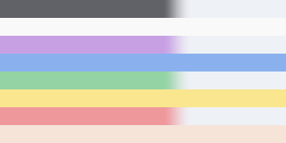
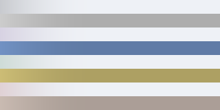

被覆率は次の順で決まります。

1. 面の向き（`Upward Bias` が 1 に近いほど上向きの面だけ）とマスクを掛ける
2. そこへ水滴と垂れの模様を**足す**（`Droplets` を上げたとき）
3. 境界とぼかしでしきい値をかけ、最後に `Amount` を掛ける

粒と垂れは 1 の後に足されるため、**下向きの面やマスクで抜いた場所にも付きます**。
雨や汗を場所で抑えたいときは `Upward Bias` や `Mask Channel` ではなく、
`Droplets` そのものを下げてください。

### 基本

| プロパティ | 説明 |
| --- | --- |
| Amount | 全体の強さ。被覆率に掛かる（`0` で色・法線の寝かせ・厚みが消える） |
| Overlay Texture | 重ねる模様。汚れや雪の粒に使う |
| Overlay Color | 重ねる色。アルファが色の置き換え量（雨や汗は `0`） |
| Mask Channel | 共有マスクのどのチャンネルを使うか。None で全面 |
| Upward Bias | 上向き面への寄り。雪や埃は高め、汚れは低め |
| Border / Border Blur | 覆われたと見なす境界とそのぼかし |
| Pattern Scale | 粒と筋の全体の細かさ。オブジェクトの大きさに合わせる |

### 濡れと積もり

| プロパティ | 説明 |
| --- | --- |
| Wet Darkening | 覆われた部分の素の色を暗く濃くする。雨・汗向け |
| Settled Roundness | 覆われた部分の法線を上向きに寝かせる。雪向け |
| Settled Thickness | 頂点を押し出して厚みを出す。単位はメートル |
| Thickness Direction | `1` で真上、`0` で面の法線に沿って押し出す |
| Vertex Color Mask | 厚みを抑える頂点カラーのチャンネル |

厚みだけは**被覆率とは別の経路**です。頂点シェーダーではマスクテクスチャを
引けないため、`Settled Thickness` は面の向きと `Vertex Color Mask`（頂点カラー）
だけで決まります。**`Mask Channel` で抜いた場所も頂点は押し出されます。**
厚みを場所で抑えるには頂点カラーを使ってください。境界のぼかしも、頂点が粗いと
面が三角形に割れて見えるため、ピクセル側より広く取ってあります。

厚みは頂点変位なので、**積もりの縁は丸められません**。
丸めるにはジオメトリが要りますが、モジュールはパスもテッセレーションも
足せません。縁をなだらかにしたい場合は頂点カラーで厚みを落とすか、
モデル側に縁を用意してください。

### 水滴と垂れ

`Droplets` を上げると、面に付く水の粒が被覆率に乗ります。
粒は `Run-off` で「その場に留まるもの」と「流れ出すもの」に分かれ、
流れた粒は `Streaks` で跡を残します。垂れる向きは重力方向です。

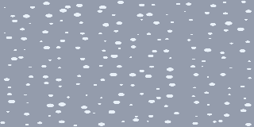
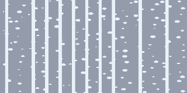

| プロパティ | 説明 |
| --- | --- |
| Droplets | 粒の量。濡れて見えるかはこれが効く |
| Droplet Density | 粒を置く格子の細かさ。下げると大きくまばらになる |
| Droplet Size | 格子に対する粒の大きさ。`1` に近づけると粒同士がくっつく |
| Size Variance | 粒の大きさのばらつき |
| Droplet Bump | 粒で法線を歪める量。`0` だと本体のハイライトが乗らず濡れて見えない |
| Run-off | `0` で全部その場に留まり、`1` で全部が流れ出す |
| Streaks / Streak Speed | 流れた跡の残り方と速さ |

### 作例

| 表現 | 効かせるもの |
| --- | --- |
| 雨 | Droplets + Run-off + Streaks + Wet Darkening、Overlay Color のアルファは `0` |
| 汗 | Droplets を弱め、Run-off を低く。Upward Bias は低め |
| 雪 | Upward Bias を高く、Settled Roundness と Settled Thickness を上げる |
| 汚れ | Overlay Texture と Overlay Color のアルファを上げ、Droplets は `0` |

## ドット絵風（Pixel Art）

明るさを段に落とし、整列ディザで段差を散らし、必要ならパレットに寄せます。
RGB をチャンネルごとに刻むのではなく、**明るさ（輝度）だけを段に落として
元の色味の比を保ちます**。チャンネルごとに刻むと、隣り合う升目で R/G/B が
別々の段へ飛んで色ノイズになるためです。
升目は画面ピクセル単位で、ベースカラー・UV・塗り分けの入力を
升目の中心の値へ揃えることで、模様と帯の境界を升目に乗せます。

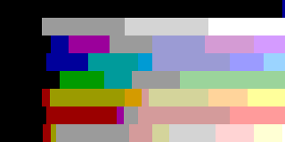
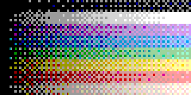

**画面そのものを間引くことはできません。** 隣接ピクセルを読むには GrabPass が
要り、このリポジトリでは使わない方針です。升目はあくまでディザと値の
スナップの粒度です。

| プロパティ | 説明 |
| --- | --- |
| Amount | 強さ。`0` で無効、`1` で完全に置き換える |
| Color Levels | 明るさの段数。下げるほど段が粗くなる。色相は元のまま残る |
| Cell Size | 升目の大きさ（画面ピクセル） |
| Dither | 段差を整列ディザで散らす量 |
| Palette Preset | 組み込みパレット。`Texture` のときだけ下のテクスチャを引く |
| Palette | 横方向のグラデーション画像。明るさで引いて色を置き換える |
| Palette Blend | パレットへの寄せ具合 |

### パレット

明るさでパレットを引いて色を置き換えます。
組み込みのプリセットは LCD / Retro / Mono / Sepia / Gray / OneBit / 8bit / Neon / Sunset の 9 種で、
`Texture` を選んだときだけ `Palette` のテクスチャを使います。

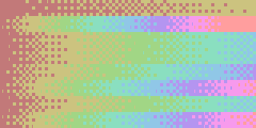
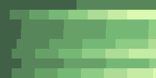
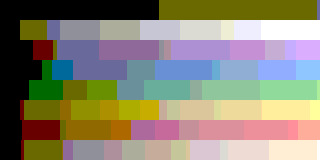

## ブラウン管・グリッチ（CRT / Glitch）

本体が描き終えた色に、走査線・シャドウマスク・ロールバー・ざらつき・砂嵐・
周辺の落ち込みと、映像が乱れたときの帯のずれ・升の破綻・色ずれを重ねます。
頂点を動かす「裂け」と「画面の丸み」も持っています。

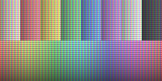
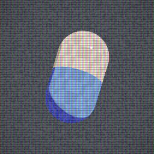

このモジュールはドット絵風の**後**にかかります（`crt-glitch.scmodule` の
`afters`）。升目に落としてからブラウン管をかける順で、逆にすると走査線と縞が
升目に飲まれます。

### 画面を撮り直さずに何をしているか

**画面を歪める・ぼかす・実際にずらすことはできません。** モジュールは
隣接ピクセルを読めないためです。ずらしが要るところ（帯のずれ・升の破綻・
色ずれ・砂嵐の引き裂き）は、勾配 (`ddx`/`ddy`) からの 1 次近似で
「ずらした先の色」を推定しています。

この近似には次の性質があります。

- 面の上で色が滑らかに変わるところではよく合う
- シルエットや模様の境目では大きく外れる。色ずれはそこで**消える**ように
  弱めてある（そうしないと縁に色の輪が残る）。乱れた帯と升の破綻は硬い破綻が
  欲しい効果なので、上限で頭打ちにするだけで縁でも切らない
- 勾配は 2x2 のピクセルごとに 1 つしか無いので、2 ピクセルより細かい
  ずらしは段が付く

**したがって色ずれは、縁がくっきり分かれる絵ではほとんど見えません。**
広くなだらかな階調がある絵でだけ効きます。ブラウン管らしさは走査線と
シャドウマスクが担っていて、こちらはずらしを伴わないので制約を受けません。

### 入っていないもの

| 効果 | 入れていない理由 |
| --- | --- |
| りん光の残像 | 前のフレームが要る |
| 滲み・グロー | 隣接ピクセルの重み付き和が要る |
| ゴースト（ずらして重ねる） | 1 次近似では段を重ねても 1 回ずらすのと同じ式に潰れる |

ゴーストが潰れるのは次の理由です。i 段目の色は `c + g・d・i` になるので、
重み `w_i` で平均すると `Σ w_i (c + g・d・i) / Σ w_i = c + g・d・(i の加重平均)`
となり、1 回ずらしたのと同じ形になります。段ごとに色を回せば潰れなくなりますが、
それは色が変わるだけで、像が「ずれて重なる」ようには見えません。
実測でも、色を回さずに 3 段重ねたときの差は平均 `0.15 / 255` しか出ませんでした。

### 走査線とシャドウマスク

| プロパティ | 説明 |
| --- | --- |
| Amount | 全体の強さ。`0` で無効 |
| Scanlines / Scanline Pitch | 横方向の暗い線と、その間隔（画面ピクセル） |
| Shadow Mask / Mask Pitch | RGB の縦縞と、R・G・B 3 本 1 組の幅（画面ピクセル） |
| Vignette | 画面の外側ほど暗くする |
| Chromatic Aberration | 赤と青を逆向きに離す幅（画面ピクセル） |
| Screen Curvature | 画面の丸み。頂点を動かす（[後述](#画面の丸み)） |

縞は 3 つに割り切ってあります。位相をずらした余弦を重ねると、山と山の
中間で 2 色が同時に持ち上がり、面全体が黄色や水色に寄って見えるためです。
該当する縞を 2.4、隣を 0.3 にしてあり、平均は 1 なので全体の明るさは
変わりません。

縞と線はどちらも画面ピクセル単位なので、**遠くのアバターでは縞が細かく
なりすぎて色が偏って見えます**。遠景で使うなら間隔を広げてください。

### 画面の丸み

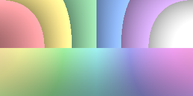

ブラウン管の面が丸いぶん、外側ほど像が外へ膨らみます。
**絵を曲げることはできないので、モデルの頂点そのものを動かしています。**
そのため次の副作用があります。

- 三角形の間は直線で結ばれるので、**粗いメッシュは曲がりません**。
  立方体のように角にしか頂点が無い形は、面が斜めに引かれるだけになります
- 頂点が実際に動くので、**他のオブジェクトとの位置関係が崩れます**
- **画面の中心から離れたものほど外へ押し出されます。** 膨らむだけでなく、
  位置ごと動きます
- 影のパスでは効かせていません。曲がりは見る人の画面に対して決まるので、
  ライトから見た空間で同じ式を通しても意味がないためです。そのぶん
  **影の形は曲がる前のまま**残ります

上の図は、頂点の代わりに表を引く座標を同じ式で曲げたものです。

### ざらつきと砂嵐

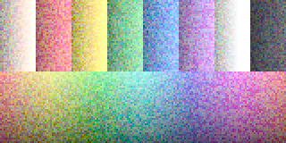
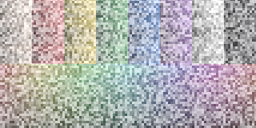
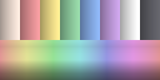

| プロパティ | 説明 |
| --- | --- |
| Grain / Grain Size | 画面に散らす粒と、その大きさ（画面ピクセル） |
| Midtone Bias | 上げるほど中間調にだけ粒が乗り、明部と暗部で消える |
| Color Grain | `0` で明るさだけ、上げると RGB が別々に揺れて色の粒になる |
| Static | 像を無彩色のノイズへ置き換える割合 |
| Static Tearing | 置き換える前に行ごとに横へずらす幅（画面ピクセル） |
| Roll Bar / Roll Speed | 垂直同期がずれた画面に出る、ゆっくり流れる明るい帯 |

砂嵐は走査線とシャドウマスクの**前**に置き換えます。ブラウン管が砂嵐を
映しているのと同じ順で、縞と線は砂嵐の上に乗ります。

ForwardAdd では、ライト数に応じて粒や砂嵐が増えないよう、それらの生成は
ForwardBase だけで行います。砂嵐による元画像の減衰と横裂けは各パスへ適用します。

ざらつきの時間は 24 分の 1 秒、乱れの時間は 12 分の 1 秒に刻んであります。
滑らかに動かすと粒が流れて見えるので、コマで切り替わるようにしてあります。

### 乱れと裂け

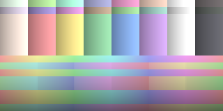
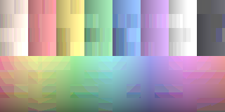

| プロパティ | 説明 |
| --- | --- |
| Band Glitch | 横帯の出やすさ。`0` で 1 本も出ず、`1` ですべての帯が出る |
| Band Height / Band Shift | 帯の高さと横ずれの幅（どちらも画面ピクセル） |
| Band Channel Swap | 帯で RGB を入れ替える量 |
| Block Glitch | 升の破綻の出やすさ |
| Block Size / Block Shift | 升の大きさと横ずれの幅（どちらも画面ピクセル） |
| Block Color Crush | 升ごとに色を段へ落とす量 |
| Vertex Tearing / Tear Band Height | 頂点を帯ごとに横へずらす幅と、帯の高さ（どちらもメートル） |

横帯は走査が横にずれた画に、升の破綻は圧縮が壊れた画に近い見た目です。
`Block Color Crush` は加算合成できない非線形処理なので ForwardBase だけに適用し、
ForwardAdd では升の横ずらしだけを適用します。これによりライトごとの量子化は避けますが、
追加ライトの寄与そのものは色の段へ落ちません。

`Band Glitch` はピクセル側の帯と頂点の裂けの両方を出します。
裂けはモデルの高さで帯を切り、視線と上方向から作った向きへずらすので、
画面に対して水平に裂けます。帯を頂点の粗さより細かくしても分かれません。

### 作例

| 表現 | 効かせるもの |
| --- | --- |
| ブラウン管 | Scanlines + Shadow Mask + Vignette、Grain はごく弱く |
| 丸いブラウン管 | 上に Screen Curvature を足す。近景で正面から見る用途に限る |
| フィルム | Grain を上げ、Midtone Bias と Color Grain を上げる。Scanlines は `0` |
| 受信の途切れた放送 | Static + Static Tearing + Roll Bar |
| 通信の乱れ | Band Glitch + Band Shift + Band Channel Swap |
| 圧縮の破綻 | Block Glitch + Block Shift + Block Color Crush |
| 実体が乱れる | 上に Vertex Tearing を足す |
| レトロゲーム機 | ドット絵風と重ね、Scanline Pitch を升目の大きさに合わせる |

## 実装ファイル

| ファイル | 中身 |
| --- | --- |
| `Modules/SurfaceOverlay/SurfaceOverlayCore.hlsl` | 被覆率・水滴・垂れの数式（Unity 非依存・テスト対象） |
| `Modules/SurfaceOverlay/phase_morph.hlsl` | 厚みの押し出し（頂点） |
| `Modules/SurfaceOverlay/phase_base.hlsl` | 色の置き換え・沈み・法線（ピクセル） |
| `Modules/PixelArt/PixelArtCore.hlsl` | 量子化・ディザ・パレットの数式（Unity 非依存・テスト対象） |
| `Modules/PixelArt/phase_base.hlsl` | ベースカラーと UV のスナップ |
| `Modules/PixelArt/phase_modifylight.hlsl` | 塗り分けの入力のスナップ |
| `Modules/PixelArt/phase_postpixel.hlsl` | 明るさの段落としとパレット |
| `Modules/CrtGlitch/CrtGlitchCore.hlsl` | 走査線・縞・乱れ・ずらしの数式（Unity 非依存・テスト対象） |
| `Modules/CrtGlitch/crt_morph.hlsl` | 頂点の裂け（頂点） |
| `Modules/CrtGlitch/crt_postvertex.hlsl` | 画面の丸み（頂点） |
| `Modules/CrtGlitch/crt_postpixel.hlsl` | 画面側の効果（ピクセル） |

数式が `*Core.hlsl` に切り出してあるのは、ヘッドレスで描画テストできる
ようにするためです（[テストの仕組み](testing.md)）。
モジュールを自分で足す手順は[モジュールを追加する](adding-a-module.md)にあります。

## VRChat での制約

VRChat は Android / Quest のアバターに SDK 付属シェーダーしか許可しません。
このパッケージのシェーダーとモジュールは **PC アバターとワールド専用**です。
