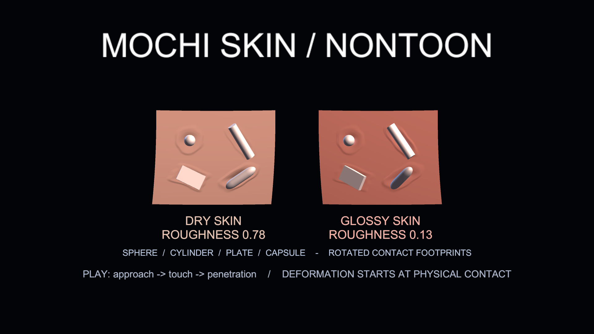

# モジュール一覧

モジュールはシェーダー本体へ効果を追加する `.scmodule` です。SabaShader には 11 種類あり、用途ごとに個別ページへ分けています。

上の画像は Package 同梱の `Advanced Shader Suite Demo` の描画結果です。掲載例は Illust2D 上で確認しています。各シェーダーで使えるモジュールは、そのシェーダーが持つ phase と変数に依存します。別のシェーダーに追加するときは Unity でコンパイルと描画を確認してください。

## 効果から選ぶ

| 効果 | 描画例 | モジュール | 代表的な調整 |
| --- | --- | --- | --- |
| 雨・汗・雪・汚れ |  | [Surface Overlay](module-surface-overlay.md) | 濡れ、積雪、水滴、垂れ |
| ドット絵風 |  | [Pixel Art](module-pixel-art.md) | 明るさの段数、ディザ、パレット |
| 動画・外部入力 |  | [Video Input](module-video-input.md) | 入力テクスチャ、色付け、混合 |
| LCD・LED |  | [Display Panel](module-display-panel.md) | 画素構造、パネル継ぎ目 |
| 走査線・ノイズ・乱れ |  | [CRT / Glitch](module-crt-glitch.md) | 走査線、砂嵐、glitch |
| 画像の貼り付け |  | [Decal](module-decal.md) | UV／投影、合成、マスク |
| 肌・布の微細質感 |  | [Surface Detail](module-surface-detail.md) | 高さ場、micro normal、粗さ |
| 接触による変形 |  | [Mochi Skin](module-mochi-skin.md) | 接触点、押し込み、部位別の硬さ |
| 表面内の空間 |  | [Spatial Interior](module-spatial-interior.md) | 宇宙、星空、cyber、泥状空間 |
| 登場・退場 |  | [Transition](module-transition.md) | 境界、glitch、液体から固体への遷移 |
| 衣装の切り替え |  | [Transformation Bank](transformation-bank.md) | 衣装の出現・退場、Clip生成、Style |

「高度モジュール」はパッケージ上の種別ではありません。11 種類は同じ `.scmodule` の仕組みで追加します。

## 有効にする

Shader Core はシェーダーごとに有効なモジュールを持ちます。Unity では対象マテリアルの `Select Modules` からモジュールを選んで `Apply` を押します。本パッケージのモジュールはシェーダーと別ディレクトリにあるため、この操作が必要です。有効化すると、マテリアルのインスペクタに設定欄が現れます。

多くのモジュールは `Amount = 0` で無効になります。Surface Overlay も `Amount = 0` で法線の歪みを含めて停止します。Transition は `Progress = 1` が完全表示状態です。

## サンプルを確認する

Package Manager の `Samples` から `Advanced Shader Suite Demo` を Import し、`AdvancedShaderSuiteDemo.unity` を開くと Decal、Surface Detail、Spatial Interior、Transition の代表設定を比較できます。Mochi Skin は `Mochi Skin World Demo` に専用のサンプルがあります。

`Advanced Shader Demo Object` はサンプル専用の表示補助 Component で、アバターやワールドへ追加する必要はありません。モジュール構成を変えた後にマゼンタ表示になった場合は、各オブジェクトで `Rebuild Demo Preview` を実行するか、コンポーネントを有効化し直してください。

## 処理順と負荷

Decal がアルベドへ画像を合成し、Surface Detail が微細な法線と粗さを変更し、Mochi Skin が接触による法線と頂点を変形します。Spatial Interior はライティング後の色を置き換え、Transition は最後に境界と clip を適用します。効果を重ねると PC での描画負荷が増えるため、対象マテリアルと画面占有面積を確認してください。VRChat の Android / Quest アバターは SDK 付属シェーダー以外を使用できず、このパッケージのシェーダーとモジュールは PC アバターとワールド向けです。詳細は[対応環境](adding-a-module.md#vrchat-での制約)を参照してください。

実装と検証の手順は[モジュールを追加する](adding-a-module.md)と[テストの仕組み](testing.md)を参照してください。
