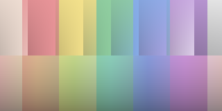
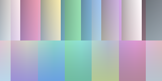
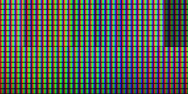
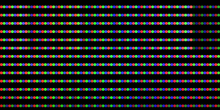
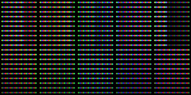
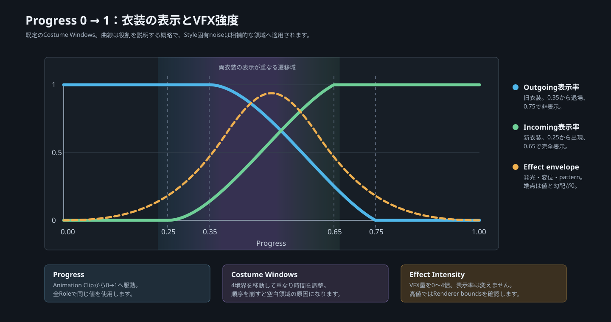

# Shader拡張一覧

Shader拡張はShader Coreのmodule機構を使い、対応Materialへ表面効果、表示加工、空間表現、遷移を追加します。Materialの`Shader`を置き換えるCore Shaderとは導入操作が異なります。

## 有効化方法

1. 対応するCore Shaderを使ったMaterialを選ぶ
2. Material Inspectorの`Select Modules`を開く
3. 必要なmoduleを有効にして`Apply`を押す
4. 追加されたInspector項目で`Amount`または`Progress`を設定する
5. Animation Controllerから動かす場合は、対象のmaterial propertyをAnimation Clipへ記録する

module一覧に項目がない場合は、対象shaderがShader Coreのmodule phaseを公開しているか確認してください。SabaShader内の代表設定はIllust2Dで検証しています。衣装変身バンクはIllust2DとNonToonを日常利用対象として互換性を確認します。

以下では各拡張のレンダリングイメージ、用途、主要パラメータを同じ順序で示します。値域、初期値、処理順、制約は各詳細ページを参照してください。

## 基本拡張

表面への付加表現や最終色の加工を行う5項目です。全パラメータ、処理順、制約は[基本拡張の詳細](modules.md)を参照してください。

### Surface Overlay

雨、汗、雪、汚れを、面の向き、mask、proceduralな水滴と垂れで重ねます。`Amount`で全体量を決め、積雪では頂点を押し出せます。

| 操作目的 | 主なパラメータ |
| --- | --- |
| 全体量と付着範囲 | `Amount`、`Mask Channel`、`Upward Bias`、`Border / Blur` |
| 色と濡れ | `Overlay Texture / Color`、`Wet Darkening` |
| 積雪 | `Settled Roundness / Thickness`、`Thickness Direction` |
| 水滴と垂れ | `Droplets`、`Density / Size / Bump`、`Run-off`、`Streaks / Speed` |

### Pixel Art

最終色の明るさを段階化し、screen pixel基準の整列ditherやpalette置換を適用します。元の色相を維持した段階化と、preset paletteによる色置換を選べます。

| 操作目的 | 主なパラメータ |
| --- | --- |
| 適用量 | `Amount` |
| 階調 | `Color Levels`、`Dither` |
| 升目 | `Cell Size` |
| 色数とpalette | `Palette Preset`、`Palette`、`Palette Blend` |

### Video Input

VideoPlayerやcameraが更新する`RenderTexture`をUV0で読み、ライティング後の色へUnlitで合成します。再生、取得、network同期はこのmoduleの対象外です。

| 操作目的 | 主なパラメータ |
| --- | --- |
| 入力と適用量 | `Input Texture`、`Amount` |
| UV範囲 | `Tiling / Offset` |
| 色と明るさ | `Input Tint`、`Brightness` |
| 向き | `Mirror Horizontally`、`Flip Vertically` |

### Display Panel

最終色へLCD、LED、LED Wallの画素構造を重ねます。screen pixel基準のsubpixel、遮光部、panel seam、panelごとの輝度差を表現します。

| 操作目的 | 主なパラメータ |
| --- | --- |
| 表示方式 | `Mode`、`Amount` |
| 画素構造 | `Pixel Pitch`、`Fill`、`Grid`、`Subpixel / Order` |
| 見え方 | `Brightness`、`View Angle` |
| LED Wall | `Tile Cells`、`Seam`、`Tile Variation` |

### CRT / Glitch

走査線、shadow mask、grain、砂嵐、roll bar、帯やblockの乱れ、頂点の裂けを追加します。GrabPassを使わないため、周辺pixelの再sampleが必要な本物のblurや残像は行いません。

| 操作目的 | 主なパラメータ |
| --- | --- |
| CRT基礎 | `Scanlines / Pitch`、`Shadow Mask / Pitch`、`Vignette` |
| Noise | `Grain / Size`、`Static / Tearing`、`Roll Bar / Speed` |
| 映像の乱れ | `Band Glitch / Height / Shift`、`Block Glitch / Size / Shift` |
| meshの裂け | `Vertex Tearing`、`Tear Band Height` |

## 高度拡張

Material表面の意味やobject-space表現を追加する4項目です。下の画像は左からDecal、Surface Detail、Spatial Interiorの代表設定と、3種類のTransitionを比較しています。全パラメータと負荷上の注意は[高度拡張の詳細](modules-advanced.md)を参照してください。

### Decal

任意画像をUVまたはobject-spaceの直方体projectionでalbedoへ合成します。衣装logo、tattoo、汚れ、識別記号などをmesh編集なしで追加できます。

| 操作目的 | 主なパラメータ |
| --- | --- |
| 合成 | `Amount`、`Texture / Tiling / Offset`、`Tint`、`Blend Mode` |
| 配置方式 | `UV Channel`または`Projection` |
| Projection範囲 | `Projector Center / Rotation / Size`、`Angle Fade`、`Edge Softness` |
| 部位制限 | `Mask Channel` |

### Surface Detail

skinの毛穴やfabricの織りをproceduralな微細高さ場として加え、色の微差、micro normal、roughness、grazing sheenを調整します。

| 操作目的 | 主なパラメータ |
| --- | --- |
| 種類と密度 | `Mode`、`Scale`、`Amount` |
| 微細形状 | `Normal Strength`、`Pore`、`Weave` |
| 色と反射 | `Albedo Variation`、`Roughness Variation`、`Sheen / Color` |
| 外部dataと部位 | `Detail Texture`、`Mask Channel` |

### Spatial Interior

mesh表面を窓として、Universe、Starfield、Cyber、Mudのprocedural空間を表示します。実geometryに穴を開けず、表面色を奥行きのある空間へ置き換えます。

| 操作目的 | 主なパラメータ |
| --- | --- |
| 表現選択 | `Preset`、`Amount`、`Side`、`Region` |
| 色と奥行き | `Color A / B`、`Emission`、`Scale / Depth / Parallax` |
| 星空とnebula | `Star Density / Size`、`Nebula / Scale`、`Time Scale` |
| 裂け目 | `Rift Center / Size / Noise`、`Edge Width / Color` |

### Transition

単一meshの登場と退場を`Progress`で制御します。Upward Dissolve、Glitch Spawn、Liquid to Solidの3 modeを持ちます。衣装AとBを連続的に切り替える用途では次の衣装変身バンクを使用します。

| 操作目的 | 主なパラメータ |
| --- | --- |
| 共通進行 | `Progress`、`Mode`、`Bounds`、`Direction` |
| Dissolve | `Noise`、`Edge Width / Color`、`Displacement` |
| Glitch | `Block Scale`、`Edge Width`、`Displacement` |
| Liquid | `Liquid Amplitude`、`Irregular Wobble`、`Puddle`、`Frequency / Speed / Tint` |

## 衣装変身バンク

衣装Aと衣装BのRendererを同じ`Progress`で連携させ、途中状態をsurface VFXと専用Particleで覆う遷移用拡張です。Animation Clip Generatorで対象衣装、style、時間を選び、互換Materialの生成または修復とClip生成を行えます。

| 操作目的 | 主なパラメータ |
| --- | --- |
| Clip生成 | `Outfit A / B Root`、`Style`、`Duration`、`Output Folder`、`Clip Name` |
| 表示の受け渡し | `Progress`、`Role`、`Visible Start / End`、`Transition Softness` |
| VFX形状 | `Effect Intensity`、`Noise Scale / Speed`、`Edge Width`、`Displacement` |
| 色と発光 | `Primary / Secondary Color`、`Emission` |
| Particle | `Particle Intensity`、`Particle Size`とstyle別Particle System |

Style別の用途、全Materialパラメータ、Generatorの変更範囲、NonToon互換性、troubleshootingは[衣装変身バンクの詳細](transformation-bank.md)を参照してください。

## 選択基準

| やりたいこと | 拡張 |
| --- | --- |
| 雨、汗、雪、汚れ | Surface Overlay |
| pixel artや限定palette | Pixel Art |
| 動画、camera、RenderTexture表示 | Video Input |
| LCD、LED、LED Wall | Display Panel |
| 走査線、砂嵐、映像やmeshのglitch | CRT / Glitch |
| logo、tattoo、局所投影 | Decal |
| skinやfabricの微細質感 | Surface Detail |
| 宇宙、星空、cyber空間、裂け目 | Spatial Interior |
| 1つのmeshの登場・退場 | Transition |
| 衣装Aから衣装Bへの連続変身 | 衣装変身バンク |
