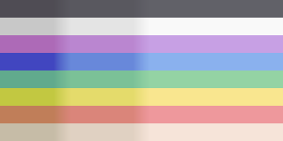
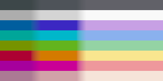
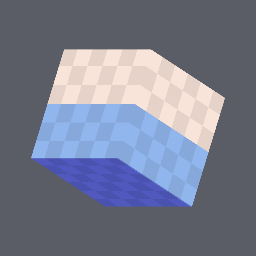
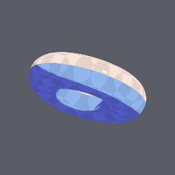
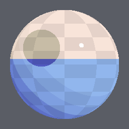
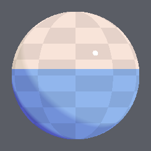
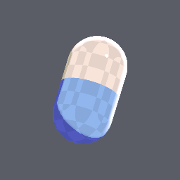
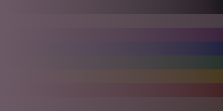
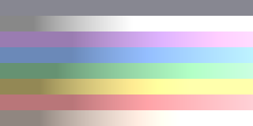

# SabaShader/Illust2D

3D モデルを 2D イラスト調に見せるトゥーンシェーダーです。
ビルトインレンダーパイプライン（BiRP）向けで、VRChat のアバターを想定しています。

> このページの図は、すべて[描画回帰テスト](testing.md#1-描画回帰テストヘッドレス)の
> ゴールデン画像です。出荷する `Illust2DCore.hlsl` をそのまま描いたものなので、
> 数式を変えれば図も変わります。手で描いた説明図ではありません。

## 考え方

「イラストっぽさ」は影の濃さではなく **影の色** で決まります。
このシェーダーは影を「暗くする」のではなく、ベースカラーの
色相・彩度・明度をずらした別の色に **置き換え** ます。
影を少し寒色側にずらして彩度を上げる、という手描きの塗りでよく使われる操作を
そのままパラメータにしています。

## パス構成

| パス | LightMode | 役割 |
| --- | --- | --- |
| FORWARD | ForwardBase | 本体の塗り |
| OUTLINE | ForwardBase | 反転ハル方式の輪郭線 |
| FORWARD_DELTA | ForwardAdd | 追加ライト（加算） |
| SHADOW_CASTER | ShadowCaster | 影の落とし |

## パラメータ

### 基本

| プロパティ | 説明 |
| --- | --- |
| Texture / Color | ベースカラー |
| Normal Map / Roughness | 法線とラフネス（Shader Core 共通の扱い） |
| Cull | 描画する面。両面表示は Off |
| Alpha Mode / Cutoff | `Cutout` で Cutoff 未満のピクセルを捨てる |

### 塗り

影は 2 段（1影・2影）です。`ln = dot(N, L) * 0.5 + 0.5` を落ち影で減衰させた値を
それぞれの境界とぼかしでランプ化し、albedo → 1影 → 2影 と補間します。

| プロパティ | 説明 |
| --- | --- |
| Shade 1 / 2 Border | 影の境界位置。2影の境界は 1影の境界を超えないよう自動で切り詰められます |
| Shade 1 / 2 Blur | 境界のぼかし幅。`0` で完全な 2 値（アニメ塗り） |
| Shade 1 / 2 Hue Shift | 影の色相シフト。**イラストらしさの中核** |
| Shade 1 / 2 Saturation / Value | 影の彩度・明度 |
| Shade 1 / 2 Multiply Color | 上記を適用した後に掛ける色 |
| Ramp Steps | `2` 以上でぼかし部分を階段状に量子化 |
| Received Shadow Strength | リアルタイム影を塗りに反映する量 |
| Shade Mask Channel | 共有マスクのどのチャンネルを影マスクに使うか |

初期値は「肌色にほんの少し紫を混ぜた 1影」になるよう調整してあります。
硬いアニメ塗りにしたい場合は Blur を 0、Border を 0.55 前後にしてください。

### ハイライト

Blinn-Phong の反射をしきい値で切ったハードなハイライトです。
`Specular Sharpness` が実際の指数（`exp2(sharpness * 10 + 1)`）を決め、
`Border` / `Blur` が切り出す形を決めます。

### リムライト

`1 - dot(N, V)` をランプ化したものです。
`Follow Light Direction` を 1 にするとライトが当たっている側にだけ出ます。
初期値は黒（無効）なので、使う場合は色を設定してください。

### 輪郭線

法線方向に押し出した反転ハル方式です。

| プロパティ | 説明 |
| --- | --- |
| Outline Width | 太さ。1.0 でおよそ 1cm 相当 |
| Base Color Blend | 1 に近づけるほど部位ごとの色に馴染む「色トレス」になる |
| Outline Hue Shift / Saturation / Value | 色トレス時のずらし量 |
| Distance Compensation | 1 で離れても画面上の線幅がほぼ一定になる |
| Width Mask Vertex Color | 頂点カラーのどの成分で太さを絞るか（顔まわりを細くする用途） |

法線が割れているモデルでは輪郭線も割れます。
モデル側で輪郭線用に法線を整えるか、頂点カラーで該当部分の幅を 0 にしてください。

### ライトの受け方

VRChat はワールドごとに明るさがまったく違うため、総照度をクランプします。

| プロパティ | 説明 |
| --- | --- |
| Brightness Min / Max | 総照度（輝度）の下限・上限 |
| Monochrome Lighting | 1 でワールドのライト色に染まらなくなる |
| As Unlit | 1 でライトを無視してテクスチャそのままの明るさになる |
| Probe Directional Weight | ライトプローブの指向性成分を塗りに使う量 |
| Probe Direction Influence | 影の向きを決める際にライトプローブを考慮する量 |

ライトの合成方針は「全ライトを 1 本の代表ライトにまとめる」です。
方向は輝度で重み付けした和、色は単純な和を使い、
ライトプローブからは L0/L1 だけを取り出して指向性成分と環境光に分けています。

### 仕上げ

最終出力に彩度とコントラストを掛けます。
少し上げるとイラストらしい発色になりますが、上げすぎると VRChat の
ポストプロセスと喧嘩するので控えめが無難です。

## 実装ファイル

| ファイル | 中身 |
| --- | --- |
| `Illust2D.scshader` | ShaderLab（4 パス） |
| `Illust2D_properties.hlsl` | プロパティ定義 |
| `sc_common.hlsl` | Shader Core が要求するフック（頂点変形・アウトライン押し出し・クリップ） |
| `Illust2DCore.hlsl` | シェーディングの数式（Unity 非依存・テスト対象） |
| `Illust2DLighting.hlsl` | ライトの集約とライトプローブの扱い |
| `Illust2DFragment.hlsl` | ForwardBase / ForwardAdd のピクセルシェーダー |
| `Illust2DOutlineFragment.hlsl` | 輪郭線のピクセルシェーダー |
| `lang/*.po` | マテリアルエディタの日本語・英語表示 |

数式が `Illust2DCore.hlsl` に切り出してあるのは、
ヘッドレスで描画テストできるようにするためです（[docs/testing.md](testing.md)）。
