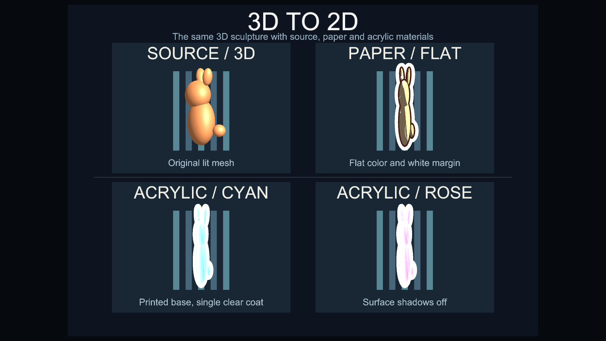

# Thin2D の比較

Paper2D と Acrylic2D は、同じ 3D メッシュを紙作品またはアクリル作品のように見せる PC 向け BiRP シェーダーです。

Package 同梱の `Thin2D Demo` を Unity 2022.3.22f1 で描画しました。左上が元の 3D マテリアル、右上が Paper2D、下段の 2 例が Acrylic2D です。両シェーダーとも `Local Z thickness = 0.18` に設定しています。

| シェーダー | 主な表現 | 個別の設定 |
| --- | --- | --- |
| [Paper2D](shader-paper2d.md) | 平らな陰影、暗い外形線、白い余白、紙の粒子 | [Paper2D のページ](shader-paper2d.md) |
| [Acrylic2D](shader-acrylic2d.md) | 印刷面、アクリル層、色付きの縁、内部散乱光、視差 | [Acrylic2D のページ](shader-acrylic2d.md) |

## 側面を比較する

`Local Z thickness` (`_DepthScale`) は各 Renderer のローカル Z 座標を縮小します。`1` は元の形状、`0.02` はほぼ平面です。実際の側面形状は元のメッシュに依存します。

## Unity で確認する

Package Manager から `Thin2D Demo` を Import し、`Thin2DDemo.unity` を開きます。Scene ビューを回転すると厚みの違いを確認できます。

CI 用 Unity プロジェクトでは `SabaShader.CI.Thin2DDemoBuilder.BuildBatch` が同じシーンから前面・側面の PNG を生成します。
