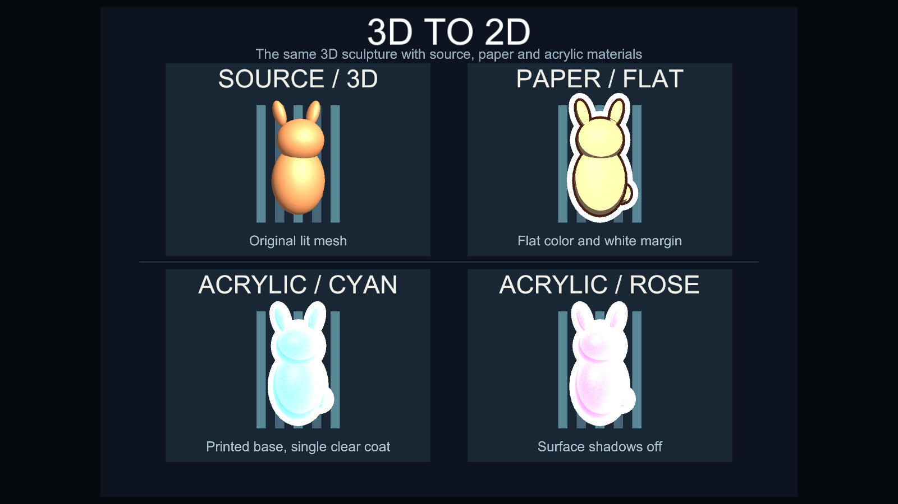

# シェーダー一覧

シェーダーはマテリアルに割り当てて、物体の描画方法を決めます。まず用途に合うシェーダーを選び、色や陰影などの設定を各ページで確認してください。モジュールは選んだシェーダーへ効果を追加する別の仕組みです。

## 用途から選ぶ

| シェーダー | 描画例 | できること | 主な対象 |
| --- | --- | --- | --- |
| [Illust2D](shader-illust2d.md) |  | 段階的な陰影、色付きの影、輪郭線などでイラスト調に描画 | アバター、ワールドの一般的なメッシュ |
| [Paper2D](shader-paper2d.md) |  | 3D メッシュを薄くし、平らな陰影と輪郭で紙作品のように描画 | 紙風の立体作品 |
| [Acrylic2D](shader-acrylic2d.md) |  | 印刷面に色付きのアクリル層と厚み・視差を重ねて描画 | アクリルグッズ風の立体作品 |
| [Debug](shader-debug.md) |  | UV、法線、頂点色、ライト入力などを色で可視化 | メッシュや描画入力の診断 |

## 比較して確認する

Paper2D と Acrylic2D は同梱の `Thin2D Demo` で同じ 3D メッシュに適用できます。[Thin2D の比較](shader-thin2d.md)では正面と側面の Unity 描画結果を並べています。Illust2D と Debug も、それぞれの詳細ページに描画例と設定方法があります。

## 効果を追加する

[モジュール一覧](modules.md)では濡れ、ドット絵、デカール、接触変形などの追加効果を用途別に選べます。モジュールの適用可否はシェーダーが持つ処理段階と変数に依存するため、組み合わせを変えた場合は Unity でコンパイルと描画を確認してください。
