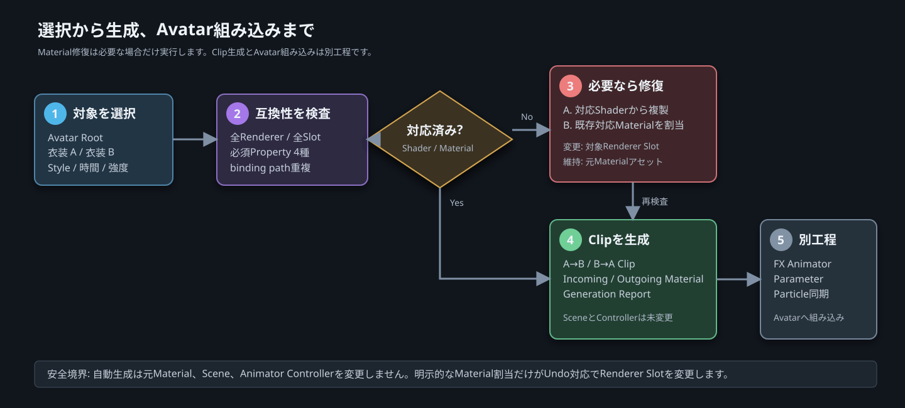
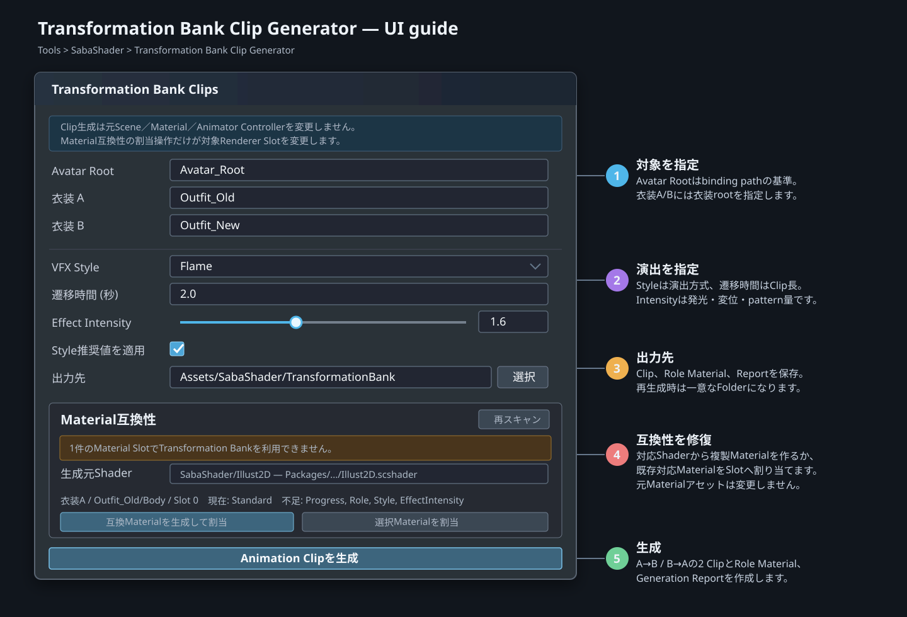

# 衣装変身バンク

`Transformation Bank` は旧衣装と新衣装を1本のAnimation Controller進行度でつなぐShader Core
モジュールです。PC向けを対象とし、`SabaShader/Illust2D` とNonToonで検証しています。

シェーダーだけで衣装GameObjectを有効・無効にはできません。変身中は旧衣装と新衣装のRendererを
有効に保ち、モジュールの `Progress` で各meshの描画範囲を制御します。旧衣装を無効にするのは
バンク完了後です。

## 最短手順

1. 衣装MaterialのInspectorで `Select Modules` を開き、`__TransformationBank` を有効にして `Apply` します。
2. `Tools > SabaShader > Transformation Bank Clip Generator` を開き、Avatar Rootと衣装A／Bを指定します。
3. Material互換性エラーが出た場合は、対応Shaderから互換Materialを生成するか、既存対応Materialを割り当てます。
4. Style、遷移時間、Effect Intensityを決め、双方向Animation Clipを生成します。
5. 生成ClipをAvatarのFX Animatorへ組み込み、必要なStyleだけParticleを別途同期します。



Clip Generatorが自動化するのは手順2～4です。FX Animator、Parameter、Particle Systemの組み込みは、Avatarごとの
既存構成や衣装切替方式が異なるため手順5の別工程としています。

## 構成

衣装に使うマテリアルInspectorで `Select Modules` を開き、
`__TransformationBank (io.github.sabas0ba.transformationbank)` を有効にして `Apply` を押します。
既存の `Appearance Transition` と同じマテリアルでは併用しません。双方がclipと頂点変位を行うためです。

| 対象 | Role | 用途 |
| --- | --- | --- |
| 変身前の衣装 | Outgoing | 中盤から退場する旧衣装 |
| 変身後の衣装 | Incoming | 中盤までに出現する新衣装 |

このモジュールはbodyの被覆を保証しません。衣装下のbodyをBlendShapeなどで隠す場合は、変身中に
旧衣装と新衣装が必要とする隠し範囲の和集合を維持してください。

## ProgressとRole

Animation Clipから両Rendererの次のmaterial propertyを0から1へ動かします。

```text
material._io_github_sabas0ba_transformationbank_Progress
```

既定timingは次の通りです。数値は `Costume Windows` で変更できます。

| Progress | Outgoing | Incoming |
| ---: | --- | --- |
| 0.00–0.25 | 完全表示 | 非表示 |
| 0.25–0.35 | 完全表示 | 出現開始 |
| 0.35–0.65 | 退場 | 出現 |
| 0.65–0.75 | 退場中 | 完全表示 |
| 0.75–1.00 | 非表示 | 完全表示 |


共通Effect envelopeはProgress中央で最大になり、0と1で値と勾配が0になるbell curveです。Animation Clipを
linear keyframeにした場合も、変身開始直後と完了直前の発光・変位が急に確定しないよう収束します。
各Styleのnoise・turbulence・頂点変位にもRole別の表示率から求めたbell curveを適用し、`Costume Windows` の
開始・終了値をまたいだときに完全表示判定へ不連続に切り替わらないようにしています。

既定値ではOutgoingとIncomingの表示率の和が1を下回りません。これはbody被覆率ではなくshader上の
表示率です。windowを変更する場合は `Incoming開始 <= Outgoing開始 <= Incoming終了 <= Outgoing終了`
の順序を維持します。

IncomingとOutgoingは相補的な表示閾値を使用します。Gaia・FlameなどでIncomingが下から上へ出現する場合、
Outgoingも下から上へ消失します。Umbra・Cyberなどのnoise／block型では、Incomingが現れる領域から
Outgoingが消えるため、両Roleが同じ領域へ重なって別領域が空白になる状態を抑制します。

変身中に別の衣装変更を受け付けると現在衣装の判定が不定になるため、FX Animatorはバンク終了まで
次の入力を受け付けない構成を推奨します。

## Animation Clip Generator

Unity Editorの `Tools > SabaShader > Transformation Bank Clip Generator` から、衣装A、衣装B、VFX Styleを
指定して双方向のAnimation Clipを生成できます。Avatar RootはAnimation bindingの相対パスを計算するために
使用します。



### 入力パラメータ

| UI | 指定内容 | 何に使われるか | 調整の目安 |
| --- | --- | --- | --- |
| Avatar Root | Avatar階層の基準GameObject | Renderer、GameObjectのAnimation binding pathを相対化 | Animatorを置くrootと同じ階層を指定 |
| 衣装 A | 変身前として扱う衣装root | A→BではOutgoing、B→AではIncoming | Avatar Rootの子孫で、衣装全体をまとめるroot |
| 衣装 B | 変身後として扱う衣装root | A→BではIncoming、B→AではOutgoing | 衣装AとRenderer binding pathが重複しないroot |
| VFX Style | 12種類の表面演出 | 生成Role Materialの `Style` と推奨値 | 最初は目的に近いStyleを選び、後からMaterialで微調整 |
| 遷移時間 | Animation Clipの長さ。0より大きい秒数 | Progress 0→1と衣装無効化keyの時間軸 | 短い変身は0.8～1.5秒、見せる変身は2～4秒から調整 |
| Effect Intensity | 発光、頂点変位、表面patternの共通倍率。0～4 | 生成する全Role Material | 1が基準。0は装飾を抑制し、1.5以上はboundsと白飛びを確認 |
| Style推奨値を適用 | Style別のnoise、発光、変位、pattern設定 | 生成Role Materialだけに適用 | 初回は有効。既に手調整済みの値を維持したい場合は無効 |
| 出力先 | `Assets` 以下のFolder | Clip、Role Material、Report、修復Materialの保存先 | Avatar単位または衣装組合せ単位のFolderを推奨 |

衣装A／Bは遷移中に同時表示されます。AとBへ同じGameObjectを指定したり、同じAnimation binding pathを持つ
Rendererを含めたりすると、1本のClipから安全に制御できないため生成を拒否します。

### Material互換性の修復

生成前に、両衣装の `SkinnedMeshRenderer` と `MeshRenderer` が使用する全MaterialでTransformation Bankが
有効になっていることを確認します。対応していないMaterial SlotやAvatar Root外の衣装がある場合は、生成せず
対象のRendererとSlotを表示します。

`Material互換性` には、選択した衣装で対応していないRenderer、Slot、不足Propertyと、現在Projectで利用可能な
Transformation Bank対応Shader／Materialが表示されます。対応Shaderがない場合は `Tools > SabaShader > Select Modules`
で `__TransformationBank` を有効にし、ApplyとShaderコンパイルの完了後に再スキャンします。

| 表示内容 | 意味 | 対応 |
| --- | --- | --- |
| 現在のMaterial／Shader | 対象Renderer Slotが現在使用しているAsset | 元Assetを残したまま複製するか、別Materialへ割り当てる |
| 不足Property | `Progress`、`Role`、`Style`、`EffectIntensity` のうち存在しないもの | `__TransformationBank` 有効化済みShaderが必要 |
| 利用可能なShader | 必須4 Propertyを持つProject内または読込済みShader | 互換Material生成時のShaderとして選択 |
| 利用可能なProject Material | 必須4 Propertyを持つProject内Material | 既存設定をそのまま対象Slotへ割当 |

各Slotは次のいずれかで修復できます。

- `互換Materialを生成して割当`: 現Materialの互換Propertyを引き継いだ新規Materialアセットを
  `PreparedMaterials` に生成し、選択した対応Shaderへ切り替えてSlotへ割り当てます。
- `選択Materialを割当`: Project内の既存対応MaterialをSlotへ割り当てます。

どちらも元MaterialアセットのShaderやPropertyを変更しません。明示的な割当操作だけがSceneまたはPrefab instanceの
Renderer Slotを変更し、UnityのUndoに対応します。Material配列が空のRendererにはSlot 0を追加します。

`互換Materialを生成して割当` は、現Materialに同名Propertyがあれば値とTextureを新Materialへ引き継ぎ、選択した
対応Shaderへ切り替えます。新Materialは通常表示を維持できるよう `Role = Incoming`、`Progress = 1` で初期化します。
異なるShader間ではProperty名や描画方式が一致しない場合があるため、割当後にBase Texture、Cull、Render Queue、
透過設定を確認してください。

### 生成物と変更範囲

生成物は次の通りです。

- 衣装Aから衣装B、衣装Bから衣装Aへの2本のAnimation Clip
- 元Materialを複製したIncoming／Outgoing Material
- 入力条件と生成Assetを記録する `TransformationBankGenerationReport.asset`

```text
<出力先>/<衣装A>_<衣装B>_<Style>/
├─ Clips/
│  ├─ <衣装A>_To_<衣装B>_<Style>.anim
│  └─ <衣装B>_To_<衣装A>_<Style>.anim
├─ Materials/
│  └─ 各元MaterialのIncoming／Outgoing複製
└─ TransformationBankGenerationReport.asset

<出力先>/PreparedMaterials/
└─ Material互換性セクションで生成した修復Material
```

| 操作 | 新規Asset | Scene／Prefabへの変更 | 元Materialへの変更 |
| --- | --- | --- | --- |
| 互換Materialを生成して割当 | 修復Material | 対象Renderer Slotだけ変更。Undo対応 | なし |
| 選択Materialを割当 | なし | 対象Renderer Slotだけ変更。Undo対応 | なし |
| Animation Clipを生成 | 2 Clip、Role Material、Report | なし | なし |

Clip生成自体は元Material、Scene上のRenderer、GameObjectの有効状態を変更しません。Animation Clip内のMaterial reference curveで
複製Materialへ切り替え、両衣装を遷移中に有効化します。Outgoing衣装はProgressが1になり完全に非表示となる
最終frameで無効化されるため、衣装間に空白frameを作りません。既存Folderを上書きせず、再生成時は一意なFolderへ
出力します。

Clip GeneratorはAnimation Clip生成までを対象とします。Animator Controller、FX Layer、Parameter、Particle Systemの
Avatarへの組み込みは別工程です。

## Material Inspectorパラメータ

### 進行と表示区間

| Property | 範囲／既定値 | 何ができるか | 注意点 |
| --- | --- | --- | --- |
| Progress | 0～1／1 | 1本の値で旧衣装の退場、新衣装の出現、VFX envelopeを同期 | 全Roleで同じAnimation Curveを使用 |
| Role | Incoming／Outgoing | Materialを新衣装または旧衣装として扱う | 生成ClipはRole別複製Materialへ自動切替 |
| Style | 12 Style／Arcane | clip方式、頂点変位、表面patternを一括選択 | Style変更後は推奨値の再適用を検討 |
| Effect Intensity | 0～4／1 | 発光、頂点変位、patternをまとめて弱める／強める | 表示率と遷移時間は変わらない |
| Costume Windows（衣装表示区間） | XY: 0.25, 0.65／ZW: 0.35, 0.75 | XYでIncoming開始・完了、ZWでOutgoing退場開始・完了を設定 | `X <= Z <= Y <= W` の順序を維持 |
| Direction（方向） | XYZ／(0, 1, 0) | 下→上、横方向、斜め方向などobject-spaceの進行方向を指定 | meshのobject-spaceに依存。変更後はBoundsも調整 |
| Bounds（高さ範囲） | XY／(-1, 1) | Direction軸上で衣装全体を覆う最小・最大位置を指定 | 狭すぎるとProgress端点でも一部が残る |

`Progress` はAnimation Controllerから動かす主制御値です。`Costume Windows` はその0～1内のどこで衣装を
出し始め、消し終えるかを決めます。遷移を長く見せたい場合はClipの遷移時間を伸ばし、衣装同士の重なりだけを
増やしたい場合はIncoming開始を早めるかOutgoing終了を遅らせます。

### 境界、変位、表面pattern

| Property | 範囲／既定値 | 上げた場合 | 下げた場合 |
| --- | --- | --- | --- |
| Noise Scale | 0.1～64／8 | 細かい境界noise | 大きく滑らかな塊 |
| Boundary Noise（境界noise） | 0～1／0.35 | 境界、炎、Glitch、Meltの乱れが大きい | Directionに沿った均一な境界 |
| Edge Width | 0.001～0.5／0.07 | 発光境界が太い | 細く鋭い境界 |
| Edge Color | HDR／水色 | 境界発光の色とalpha倍率を変更 | alpha 0で境界色を抑制 |
| Edge Emission | 0～12／2.5 | ライト非依存の境界発光が強い | 発光を抑制 |
| Vertex Offset（頂点変位） | 0～1／0.12 | 境界付近の頂点移動が大きい | silhouette変形を抑制 |
| Block Scale | 0.5～64／8 | Cyber、Umbra、Shatter、Glitchのcellが細かい | 大きなblock／破片 |
| Pattern Color | HDR／水色 | 表面patternの色とalpha倍率を変更 | alpha 0でpattern色を抑制 |
| Pattern Scale | 0.1～64／6 | 紋様、格子、星、ひび、scanline等が細かい | 大きなpattern |
| Pattern Speed | -8～8／1 | 正方向へ速く変化 | 0で静止、負値で逆方向 |
| Pattern Emission | 0～12／2 | ライト非依存の表面発光が強い | pattern発光を抑制 |

`Effect Intensity` を上げる場合はSkinnedMeshRendererのboundsも広げ、カメラ角度によるcullingを
確認してください。

### 目的別の調整例

| 目的 | 最初に調整する値 | 確認点 |
| --- | --- | --- |
| 控えめな日常切替 | Effect Intensity 0.4～0.9、Edge／Pattern Emissionを低め | clip境界だけが認識できるか |
| 派手な変身 | Effect Intensity 1.5～2.5、Edge／Pattern Emission、Particle Intensity | HDR白飛び、Renderer bounds、Particle負荷 |
| 下から上ではなく横方向 | DirectionをX軸方向にし、Boundsを衣装幅へ合わせる | object-space回転後も全meshを覆うか |
| 大きな破片／block | Block Scaleを下げ、Vertex Offsetを上げる | silhouetteの崩れと衣装外への変位量 |
| 細かな炎／霧 | Noise Scaleを上げ、Boundary Noiseを調整 | 動画圧縮時のちらつき |
| 色だけAvatarへ合わせる | Edge ColorとPattern Color | HDR値とalpha倍率 |
| 衣装間の空白を減らす | Costume WindowsのIncoming開始を早め、Outgoing終了を遅らせる | 順序 `X <= Z <= Y <= W` |

## Style選択ガイド

| Style | 適する方向性 | 表示・変位 | 最初に調整する値 | Particle補助の例 |
| --- | --- | --- | --- | --- |
| Arcane | 汎用魔術、召喚 | 方向軸とnoise、魔術紋様 | Pattern Scale／Color | 魔力spark |
| Cyber | 電脳、機械 | object-space block、格子とrim | Block Scale／Pattern Speed | digital片 |
| Astral | 星界、静かな幻想 | 3D noise、星とrim | Pattern Scale／Emission | なし |
| Gaia | 岩、土、植物 | 下から上へのnoise、岩のひび | Direction／Boundary Noise | なし |
| Umbra | 闇、影、呪術 | noiseとblock、流れる影 | Noise Scale／Pattern Speed | 低密度の影霧 |
| Flame | 炎、戦闘、強い変身 | 上昇turbulence、大きな炎色noise | Boundary Noise／Emission | 多数の小さな火の粉 |
| Shatter | 分解、再構成 | cell単位clip、破片境界と散開 | Block Scale／Vertex Offset | Triangle／Quad相当のmesh particle |
| Glitch | 故障、転送、電脳変身 | noiseから粗いblock、scanlineと横ずれ | Block Scale／Pattern Speed | pixel片と断続ノイズ |
| Melt | 液体、溶解、再形成 | Outgoing融解とIncoming時間反転復元 | Boundary Noise／Vertex Offset | 液滴と水玉 |
| Cosmic Rift | 宇宙、次元移動 | 中央の裂け目から展開、星空rim | Edge Width／Pattern Emission | 背後の星片・ring |
| Magical Sparkle | 魔法少女、華やかな変身 | 下から上へ展開、cross状sparkle | Pattern Scale／Color | キラキラした魔法粒子 |
| Mana Mist | 霧、魔力収束、精霊 | 霧noiseから収束、柔らかいrim | Noise Scale／Effect Intensity | 周囲から集まる魔力霧 |

Shatterはgeometry shaderでtriangleを分離する方式ではなく、object-space cellとTriangle／Quadの
mesh particleを組み合わせます。そのためNonToonと同じShader Core経路を維持できます。Meltは
Outgoingを横方向へ波打たせながら下へ垂らし、液滴と水玉が落ちる区間で消去します。Incomingには
同じ液体境界・表面pattern・頂点変位を時間反転して適用し、下方の液体片から新衣装へ復元します。

## Particle System

Package ManagerのSamplesから `Transformation Bank Demo` をImportすると、12 Styleの表面shaderと
Particle Systemを同期再生できます。


DemoのParticleは2系統です。

- Primary: 炎片、破片、pixel、液滴、裂け目、霧など主要形状
- Accent: 火の粉、細かな破片、星、sparkleなど装飾

各Particleは汎用Quadではなく、Styleごとの手続き生成meshを使用します。Flameは小さな火の粉、Umbraは
霧粒、ShatterはTriangleとQuad片、Glitchは横長pixel片、Meltは液滴と水玉を使います。AstralとGaiaは
表面shaderだけで構成し、Particleを停止します。UmbraとMana Mistはsoft radial textureとalpha blendを
使用し、輪郭のある破片ではなく半透明の霧として合成します。
PrimaryとAccentのEmissionはStyleごとに異なるProgress区間へ同期し、変身前後の端点では停止・消去します。
生成済み形状は `TransformationBankParticleMeshes.asset` に永続化されているため、Sample Controllerを外しても
Particle SystemのMesh参照は維持されます。

Inspectorの `Particle Intensity` と `Particle Size` で調整できます。実AvatarではAnimation Clipから
Particle SystemのEmissionまたはGameObject有効状態を制御します。Particleは衣装の描画状態を置き換える
ものではなく、表面shaderの外側へ演出を追加する用途です。

| Demo Inspector | 範囲／既定値 | 作用 |
| --- | --- | --- |
| Particle Intensity | 0～4／0.75 | Primary／Accentの発生数。0で停止 |
| Particle Size | 0.1～3／1 | Style固有mesh particleの大きさ |
| Auto Animate in Play Mode | on／off | Progressの自動往復再生 |
| Animation Speed | 0.01以上／0.2 | DemoのProgress再生速度。生成Clipの遷移時間とは別 |
| Progress | 0～1／0.5 | Edit Modeで任意frameを確認 |

## よくある問題

| 状態 | 原因 | 対応 |
| --- | --- | --- |
| `Transformation Bankが有効ではありません` | MaterialのShaderに必須Propertyがない | `Select Modules`で有効化するか、Generatorから互換Materialを生成 |
| 対応Shader候補が空 | ShaderへmoduleをApplyしていないか、コンパイル中 | `__TransformationBank`をApplyし、コンパイル完了後に再スキャン |
| 端点で衣装の一部が残る | DirectionとBoundsがmesh全体を覆っていない | object-spaceの軸と最小／最大値を調整 |
| 変身中に空白が見える | Costume Windowsの順序または衣装下bodyの非表示範囲 | `X <= Z <= Y <= W`を復元し、body隠し範囲の和集合を維持 |
| Effect Intensityを上げると消える | 頂点変位がRenderer boundsを越えてculling | SkinnedMeshRenderer boundsを拡張 |
| 修復後にTextureや透過が異なる | 異なるShader間でProperty名やrender stateが一致しない | 新MaterialのBase Texture、Cull、Render Queue、透過設定を確認 |
| Clip生成後もAvatarで動かない | FX Animatorへの組み込みは自動生成対象外 | 生成ClipとParameterをAvatarのFX Layerへ別途設定 |
| Astral／GaiaでParticleが出ない | 仕様上surface shaderのみ | 必要ならAvatar側で独自Particleを追加 |

## NonToon

NonToonはShader Coreの `morph`、`base`、`postpixel` phaseを持つため、同じモジュールを追加できます。
Forward、ForwardAdd、Outline、ShadowCasterで同じ表示判定を使用します。本リポジトリではNonToon
0.1.3（`130bea3e6be5183b4fceb60df0062d38ef98067c`）を固定依存としてコンパイルしています。
