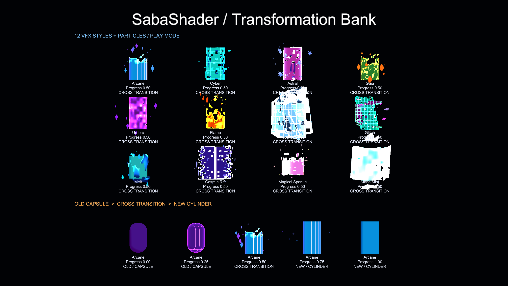

# 衣装変身バンク

`Transformation Bank` は旧衣装と新衣装を1本のAnimation Controller進行度でつなぐShader Core
モジュールです。PC向けを対象とし、`SabaShader/Illust2D` とNonToonで検証しています。

シェーダーだけで衣装GameObjectを有効・無効にはできません。変身中は旧衣装と新衣装のRendererを
有効に保ち、モジュールの `Progress` で各meshの描画範囲を制御します。旧衣装を無効にするのは
バンク完了後です。

## 構成

衣装に使うマテリアルInspectorで `Select Modules` を開き、
`__TransformationBank (io.github.sabas0ba.transformationbank)` を有効にして `Apply` を押します。
既存の `Appearance Transition` と同じマテリアルでは併用しません。双方がclipと頂点変位を行うためです。

| 対象 | Role | 用途 |
| --- | --- | --- |
| 変身前の衣装 | Outgoing | 中盤から退場する旧衣装 |
| 変身後の衣装 | Incoming | 中盤までに出現する新衣装 |

このモジュールはbodyの被覆を保証しません。衣装下のbodyをBlendShapeなどで隠す場合は、変身中に
旧衣装と新衣装が必要とする隠し範囲の和集合を維持してください。

## Animation Controller

Animation Clipから両Rendererの次のmaterial propertyを0から1へ動かします。

```text
material._io_github_sabas0ba_transformationbank_Progress
```

既定timingは次の通りです。数値は `Costume Windows` で変更できます。

| Progress | Outgoing | Incoming |
| ---: | --- | --- |
| 0.00–0.25 | 完全表示 | 非表示 |
| 0.25–0.35 | 完全表示 | 出現開始 |
| 0.35–0.65 | 退場 | 出現 |
| 0.65–0.75 | 退場中 | 完全表示 |
| 0.75–1.00 | 非表示 | 完全表示 |

共通Effect envelopeはProgress中央で最大になり、0と1で値と勾配が0になるbell curveです。Animation Clipを
linear keyframeにした場合も、変身開始直後と完了直前の発光・変位が急に確定しないよう収束します。
各Styleのnoise・turbulence・頂点変位にもRole別の表示率から求めたbell curveを適用し、`Costume Windows` の
開始・終了値をまたいだときに完全表示判定へ不連続に切り替わらないようにしています。

既定値ではOutgoingとIncomingの表示率の和が1を下回りません。これはbody被覆率ではなくshader上の
表示率です。windowを変更する場合は `Incoming開始 <= Outgoing開始 <= Incoming終了 <= Outgoing終了`
の順序を維持します。

IncomingとOutgoingは相補的な表示閾値を使用します。Gaia・FlameなどでIncomingが下から上へ出現する場合、
Outgoingも下から上へ消失します。Umbra・Cyberなどのnoise／block型では、Incomingが現れる領域から
Outgoingが消えるため、両Roleが同じ領域へ重なって別領域が空白になる状態を抑制します。

変身中に別の衣装変更を受け付けると現在衣装の判定が不定になるため、FX Animatorはバンク終了まで
次の入力を受け付けない構成を推奨します。

## Animation Clip Generator

Unity Editorの `Tools > SabaShader > Transformation Bank Clip Generator` から、衣装A、衣装B、VFX Styleを
指定して双方向のAnimation Clipを生成できます。Avatar RootはAnimation bindingの相対パスを計算するために
使用します。

生成前に、両衣装の `SkinnedMeshRenderer` と `MeshRenderer` が使用する全MaterialでTransformation Bankが
有効になっていることを確認します。対応していないMaterial SlotやAvatar Root外の衣装がある場合は、生成せず
対象のRendererとSlotを表示します。

`Material互換性` には、選択した衣装で対応していないRenderer、Slot、不足Propertyと、現在Projectで利用可能な
Transformation Bank対応Shader／Materialが表示されます。対応Shaderがない場合は `Tools > SabaShader > Select Modules`
で `__TransformationBank` を有効にし、ApplyとShaderコンパイルの完了後に再スキャンします。

各Slotは次のいずれかで修復できます。

- `互換Materialを生成して割当`: 現Materialの互換Propertyを引き継いだ新規Materialアセットを
  `PreparedMaterials` に生成し、選択した対応Shaderへ切り替えてSlotへ割り当てます。
- `選択Materialを割当`: Project内の既存対応MaterialをSlotへ割り当てます。

どちらも元MaterialアセットのShaderやPropertyを変更しません。明示的な割当操作だけがSceneまたはPrefab instanceの
Renderer Slotを変更し、UnityのUndoに対応します。Material配列が空のRendererにはSlot 0を追加します。

生成物は次の通りです。

- 衣装Aから衣装B、衣装Bから衣装Aへの2本のAnimation Clip
- 元Materialを複製したIncoming／Outgoing Material
- 入力条件と生成Assetを記録する `TransformationBankGenerationReport.asset`

Clip生成自体は元Material、Scene上のRenderer、GameObjectの有効状態を変更しません。Animation Clip内のMaterial reference curveで
複製Materialへ切り替え、両衣装を遷移中に有効化します。Outgoing衣装はProgressが1になり完全に非表示となる
最終frameで無効化されるため、衣装間に空白frameを作りません。既存Folderを上書きせず、再生成時は一意なFolderへ
出力します。

初期版はAnimation Clip生成のみを対象とします。Animator Controller、FX Layer、Parameter、Particle Systemの
Avatarへの組み込みは別工程です。

## 共通パラメータ

| Property | 用途 |
| --- | --- |
| Effect Intensity | 頂点変位、発光境界、表面patternの共通倍率。0–4 |
| Vertex Offset | object-space頂点変位量 |
| Edge Emission | clip境界のHDR発光強度 |
| Pattern Emission | 表面patternのHDR発光強度 |
| Noise Scale / Boundary Noise | 境界と流体・霧・炎の粗密 |
| Pattern Scale / Speed | 表面patternの密度と時間変化 |

`Effect Intensity` を上げる場合はSkinnedMeshRendererのboundsも広げ、カメラ角度によるcullingを
確認してください。

## Style

| Style | 表示・変位 | 表面演出 | Particle補助の例 |
| --- | --- | --- | --- |
| Arcane | 方向軸とnoise | 魔術紋様 | 魔力spark |
| Cyber | object-space block | 格子とrim | digital片 |
| Astral | 3D noise | 星とrim | なし |
| Gaia | 下から上へのnoise | 岩のひび | なし |
| Umbra | noiseとblock | 流れる影 | 低密度の影霧 |
| Flame | 上昇turbulence | 大きな炎色noise | 多数の小さな火の粉 |
| Shatter | cell単位clip | 破片境界と散開 | Triangle／Quad相当のmesh particle |
| Glitch | noiseから粗いblockへ変化 | scanlineと横ずれ | pixel片と断続ノイズ |
| Melt | Outgoingの融解とIncomingの時間反転復元 | 液体noise | 液滴と水玉 |
| Cosmic Rift | 中央の裂け目から展開 | 星空と裂け目rim | 背後の星片・ring |
| Magical Sparkle | 下から上へ展開 | cross状sparkle | キラキラした魔法粒子 |
| Mana Mist | 霧noiseから収束 | 柔らかいrim | 周囲から集まる魔力霧 |

Shatterはgeometry shaderでtriangleを分離する方式ではなく、object-space cellとTriangle／Quadの
mesh particleを組み合わせます。そのためNonToonと同じShader Core経路を維持できます。Meltは
Outgoingを横方向へ波打たせながら下へ垂らし、液滴と水玉が落ちる区間で消去します。Incomingには
同じ液体境界・表面pattern・頂点変位を時間反転して適用し、下方の液体片から新衣装へ復元します。

## Particle System

Package ManagerのSamplesから `Transformation Bank Demo` をImportすると、12 Styleの表面shaderと
Particle Systemを同期再生できます。



DemoのParticleは2系統です。

- Primary: 炎片、破片、pixel、液滴、裂け目、霧など主要形状
- Accent: 火の粉、細かな破片、星、sparkleなど装飾

各Particleは汎用Quadではなく、Styleごとの手続き生成meshを使用します。Flameは小さな火の粉、Umbraは
霧粒、ShatterはTriangleとQuad片、Glitchは横長pixel片、Meltは液滴と水玉を使います。AstralとGaiaは
表面shaderだけで構成し、Particleを停止します。UmbraとMana Mistはsoft radial textureとalpha blendを
使用し、輪郭のある破片ではなく半透明の霧として合成します。
PrimaryとAccentのEmissionはStyleごとに異なるProgress区間へ同期し、変身前後の端点では停止・消去します。
生成済み形状は `TransformationBankParticleMeshes.asset` に永続化されているため、Sample Controllerを外しても
Particle SystemのMesh参照は維持されます。

Inspectorの `Particle Intensity` と `Particle Size` で調整できます。実AvatarではAnimation Clipから
Particle SystemのEmissionまたはGameObject有効状態を制御します。Particleは衣装の描画状態を置き換える
ものではなく、表面shaderの外側へ演出を追加する用途です。

## NonToon

NonToonはShader Coreの `morph`、`base`、`postpixel` phaseを持つため、同じモジュールを追加できます。
Forward、ForwardAdd、Outline、ShadowCasterで同じ表示判定を使用します。本リポジトリではNonToon
0.1.3（`130bea3e6be5183b4fceb60df0062d38ef98067c`）を固定依存としてコンパイルしています。
